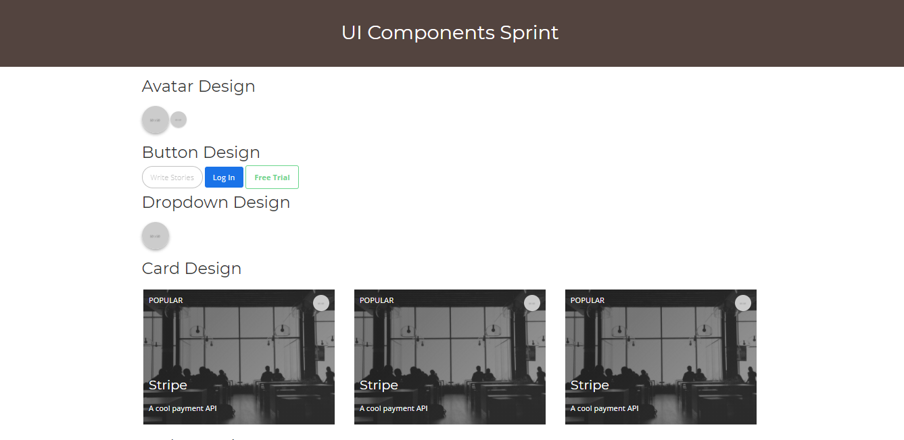
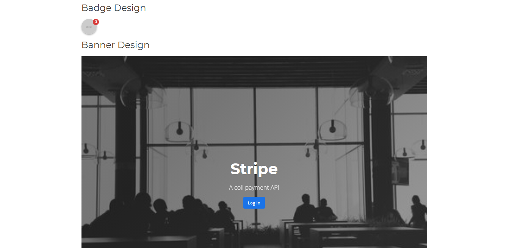
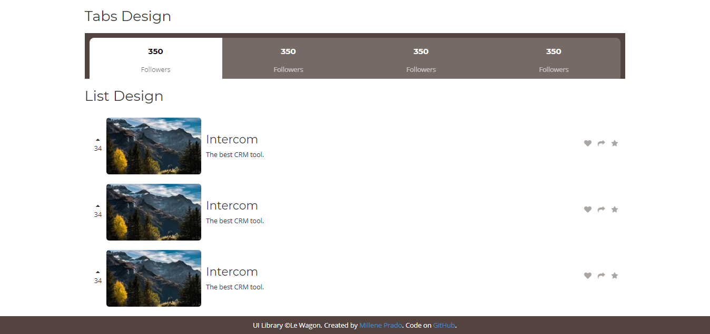

# WEB COMPONENTS

In this course, I built my own UI library with CSS:

## Web Components Created

- Avatar
- Button
- Dropdown
- Card
- Badge
- Banner
- Tabs
- List

## Resources

- [Bootstrap](http://getbootstrap.com/components/) web components
- [Flexbox guide](https://css-tricks.com/snippets/css/a-guide-to-flexbox/)
- Workshop video: [Build your UI library with CSS](https://www.youtube.com/watch?v=GNtohfhj_A4&t=12s)