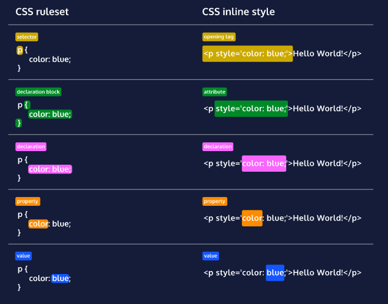
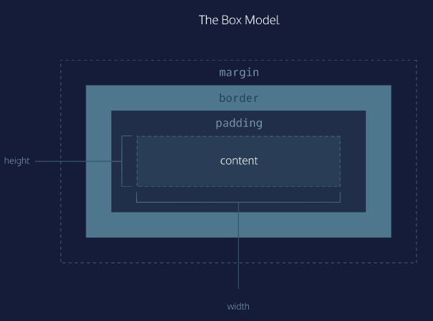
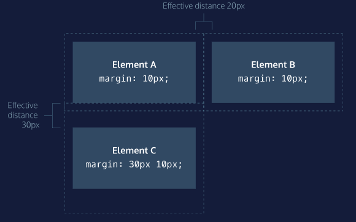

# cccLEARN CSS - CODECADEMY


### CSS Anatomy




#### Inline Styles

<p style='color:red;'>I'm learning to code!</p>

<p style='color:blue; font-size:30px;'>I'm learning to code!</p>

> It’s important to know that inline styles are a quick way of directly styling an HTML element, but are rarely used when creating websites. 


#### Internal Stylesheet

HTML allows you to write CSS code in its own dedicated section with a element nested inside of the `<head>` element. The CSS code inside the `<style>` element is often referred to as an *internal stylesheet*.

> An internal stylesheet has certain benefits and use cases over inlines styles, but once again, it’s not best practice. 


To create an internal stylesheet:

```html
<head>
  <style>
    p {
      color: red;
      font-size: 20px;
    }
  </style>
</head>
```


#### External Stylesheet

Developers avoid mixing code by storing HTML and CSS code in separate files (HTML files contain only HTML code, and CSS files contain only CSS code).

You can create an external stylesheet by using the **.css** file name extension, like so: **style.css**

When HTML and CSS codes are in separate files, the files must be linked.

You can use the `<link>` element to link HTML and CSS files together. The `<link>` element must be placed within the head of the HTML file. It is a self-closing tag and requires the following attributes:

1. `href` — like the anchor element, the value of this attribute must be the address, or path, to the CSS file.
2. `rel` — this attribute describes the relationship between the HTML file and the CSS file. Because you are linking to a stylesheet, the value should be set to `stylesheet`.


```html
<link href='./style.css' rel='stylesheet'>
```


### Selectors

#### Type

A selector is used to target the specific HTML element(s) to be styled by the declaration. One selector you may already be familiar with is the *type* selector. Just like its name suggests, the type selector matches the *type* of the element in the HTML document.

```css
p {
  color: green;
}
```

The element type is `p`, which comes from the HTML `<p>` tag.

> Since element types are often referred to by their opening tag name, the type selector is sometimes referred to as the *tag name* or *element* selector.


#### Universal

You learned how the *type selector* selects all elements of a given type. Well, the *universal selector* selects all elements of *any* type.

Targeting all of the elements on the page has a few specific use cases, such as resetting default browser styling, or selecting all children of a parent element.

The universal selector uses the `*` character in the same place where you specified the type selector in a ruleset, like so:


```css
* { 
  font-family: 'Verdana';
}
```


#### Class

CSS is not limited to selecting elements by their type. As you know, HTML elements can also have attributes. When working with HTML and CSS a *class* attribute is one of the most common ways to select an element.

```html
<p class='brand'>Sole Shoe Company</p>
```

To select an HTML element by its class using CSS, a period (`.`) must be prepended to the class’s name.

```css
.brand {

}
```


#### Multiple Classes

We can use CSS to select an HTML element’s `class` attribute by name. And so far, we’ve selected elements using only one class name per element. If every HTML element had a single class, all the style information for each element would require a new class.

Luckily, it’s possible to add more than one class name to an HTML element’s `class` attribute.

For instance, perhaps there’s a heading element that needs to be green and bold. You could write two CSS rulesets like so:

```css
.green {
  color: green;
}
 
.bold {
  font-weight: bold;
}
```

Then, you could include both of these classes on one HTML element like this:

```html
<h1 class='green bold'> ... </h1>
```

We can add multiple classes to an HTML element’s `class` attribute by separating them with a space. This enables us to mix and match CSS classes to create many unique styles without writing a custom class for every style combination needed.

#### ID

Oftentimes it’s important to select a single element with CSS to give it its own unique style. If an HTML element needs to be styled uniquely, we can give it an ID using the `id` attribute.

```html
<h1 id='large-title'> ... </h1>
```

In contrast to `class` which accepts multiple values, and can be used broadly throughout an HTML document, an element’s `id` can only have a single value, and only be used once per page.

To select an element’s ID with CSS, we prepend the `id` name with a number sign (`#`). 

```css
#large-title {
 
}
```


#### Attribute

You may remember that some HTML elements use attributes to add extra detail or functionality to the element. Some familiar attributes may be `href` and `src`, but there are [many more](https://developer.mozilla.org/en-US/docs/Web/HTML/Attributes)—including `class` and `id`!

The *attribute selector* can be used to target HTML elements that already contain attributes. Elements of the same type can be targeted differently by their attribute or attribute value. This alleviates the need to add new code, like the `class` or `id` attributes.

Attributes can be selected similarly to types, classes, and IDs.

```css
[href]{
    color: magenta;
}
```

The most basic syntax is an attribute surrounded by square brackets. In the above example: `[href]` would target all elements with an `href` attribute and set the `color` to `magenta`.

And it can get [more granular](https://developer.mozilla.org/en-US/docs/Web/CSS/Attribute_selectors#syntax) from there by adding type and/or attribute values. One way is by using `type[attribute*=value]`. In short, this code selects an element where the attribute contains any instance of the specified value. Let’s take a look at an example.

```html


```

The HTML code above renders two `` elements, each containing a `src` attribute with a value equaling a link to an image file.

```css
img[src*='winter'] {
  height: 50px;
}
 
img[src*='summer'] {
  height: 100px;
}
```

Now take a look at the above CSS code. The *attribute selector* is used to target each image individually.

- The first ruleset looks for an `img` element with an attribute of `src` that contains the string `'winter'`, and sets the `height` to `50px`.
- The second ruleset looks for an `img` element with an attribute of `src` that contains the string `'summer'`, and sets the `height` to `100px`.

Notice how no new HTML markup (like a class or id) needed to be added, and we were still able to modify the styles of each image independently. This is one advantage to using the attribute selector!


#### Pseudo-class

You may have observed how the appearance of certain elements can change, or be in a different state, after certain user interactions. For instance:

- When you click on an `<input>` element, and a blue border is added showing that it is in *focus*.
- When you click on a blue `<a>` link to *visit* to another page, but when you return the link’s text is purple.
- When you’re filling out a form and the submit button is grayed out and *disabled*. But when all of the fields have been filled out, the button has color showing that it’s *active*.

These are all examples of pseudo-class selectors in action! In fact, `:focus`, `:visited`, `:disabled`, and `:active` are all pseudo-classes. Factors such as user interaction, site navigation, and position in the DOM can all give elements a different state with pseudo-class.

A pseudo-class can be attached to any selector. It is always written as a colon `:` followed by a name. For example:

```css
p:hover {
  background-color: lime;
}
```


#### Classes and IDs

CSS can select HTML elements by their type, class, and ID. CSS classes and IDs have different purposes, which can affect which one you use to style HTML elements.

CSS classes are meant to be reused over many elements. By writing CSS classes, you can style elements in a variety of ways by mixing classes. For instance, imagine a page with two headlines. One headline needs to be bold and blue, and the other needs to be bold and green. Instead of writing separate CSS rules for each headline that repeat each other’s code, it’s better to write a `.bold` CSS rule, a `.green` CSS rule, and a `.blue` CSS rule. Then you can give one headline the `bold green` classes, and the other the `bold blue` classes.

While classes are meant to be used many times, an ID is meant to style only one element. IDs override the styles of types and classes. Since IDs override these styles, they should be used sparingly and only on elements that need to always appear the same.


#### Specificity

Specificity is the order by which the browser decides which CSS styles will be displayed. A best practice in CSS is to style elements while using the lowest degree of specificity so that if an element needs a new style, it is easy to override.

IDs are the most specific selector in CSS, followed by classes, and finally, type.

To make styles easy to edit, it’s best to style with a type selector, if possible. If not, add a class selector. If that is not specific enough, then consider using an ID selector.


#### Chanining

When writing CSS rules, it’s possible to require an HTML element to have two or more CSS selectors at the same time.

This is done by combining multiple selectors, which we will refer to as chaining. For instance, if there was a `special` class for `<h1>` elements, the CSS would look like below:

```css
h1.special{

}
```

The code above would select only the `<h1>` elements with a class of `special`. If a `<p>` element also had a class of `special`, the rule in the example would not style the paragraph.


#### Descendant Combinator

In addition to chaining selectors to select elements, CSS also supports selecting elements that are nested within other HTML elements, also known as *descendants*. For instance, consider the following HTML:

```html
<ul class='main-list'>
  <li> ... </li>
  <li> ... </li>
  <li> ... </li>
</ul>
```

The nested `<li>` elements are descendants of the `<ul>` element and can be selected with the *descendant combinator* like so:

```css
.main-list li {
 
}
```

In the example above, `.main-list` selects the element with the`.main-list` class (the `<ul>` element). The descendant `<li>`‘s are selected by adding `li` to the selector, separated by a space. This results in `.main-list li` as the final selector.

Selecting elements in this way can make our selectors even more specific by making sure they appear in the context we expect.


#### Chaining and Specificity

Adding more than one tag, class, or ID to a CSS selector increases the specificity of the CSS selector.

For instance, consider the following CSS: 

```css
p {
  color: blue;
}
 
.main p {
  color: red;
}
```

Both of these CSS rules define what a `<p>` element should look like. Since `.main p` has a class and a `p` type as its selector, only the `<p>` elements inside the `.main` element will appear `red`. This occurs despite there being another more general rule that states `<p>` elements should be `blue`.


#### Multiple Selectors

In order to make CSS more concise, it’s possible to add CSS styles to multiple CSS selectors all at once. This prevents writing repetitive code.

For instance, the following code has repetitive style attributes:

```css
h1 {
  font-family: 'Georgia';
}
 
.menu {
  font-family: 'Georgia';
}
```

Instead of writing `font-family: Georgia` twice for two selectors, we can separate the selectors by a comma to apply the same style to both, like this:

```css
h1, 
.menu {
  font-family: 'Georgia';
}
```

By separating the CSS selectors with a comma, both the `<h1>` elements and the elements with the `menu` class will receive the `font-family: Georgia` styling.


### The Box Model

Browsers load HTML elements with default position values. This often leads to an unexpected and unwanted user experience while limiting the views you can create. In this lesson, you will learn about the *box model*, an important concept to understand how elements are positioned and displayed on a website.

If you have used HTML and CSS, you have unknowingly seen aspects of the box model. For example, if you have set the background color of an element, you may have noticed that the color was applied not only to the area directly behind the element but also to the area to the right of the element. Also, if you have aligned text, you know it is aligned relative to something. What is that something?

All elements on a web page are interpreted by the browser as “living” inside of a box. This is what is meant by the box model.

For example, when you change the background color of an element, you change the background color of its entire box.




The box model comprises the set of properties that define parts of an element that take up space on a web page. The model includes the content area’s size (*width* and *height*) and the element’s *padding*, *border*, and *margin*. The properties include:

1. `width` and `height`: The width and height of the content area.
2. `padding`: The amount of space between the content area and the border.
3. `border`: The thickness and style of the border surrounding the content area and padding.
4. `margin`: The amount of space between the border and the outside edge of the element.


#### Height and Width

An element’s content has two dimensions: a height and a width. By default, the dimensions of an HTML box are set to hold the raw contents of the box.

The CSS `height` and `width` properties can be used to modify these default dimensions.

```css
p {
  height: 80px;
  width: 240px;
}
```

In this example, the `height` and `width` of paragraph elements are set to 80 pixels and 240 pixels, respectively — the `px` in the code above stands for *pixels*.

Pixels allow you to set the exact size of an element’s box (width and height). When the width and height of an element are set in pixels, it will be the same size on all devices — an element that fills a laptop screen will overflow a mobile screen.


#### Borders

A *border* is a line that surrounds an element, like a frame around a painting. Borders can be set with a specific `width`, `style`, and `color`:

- `width`—The thickness of the border. A border’s thickness can be set in pixels or with one of the following keywords: `thin`, `medium`, or `thick`.
- `style`—The design of the border. Web browsers can render any of [10 different styles](https://developer.mozilla.org/en-US/docs/Web/CSS/border-style#Values). Some of these styles include: `none`, `dotted`, and `solid`.
- `color`—The color of the border. Web browsers can render colors using a few different formats, including [140 built-in color keywords](https://developer.mozilla.org/en-US/docs/Web/CSS/color_value).


```css
p {
  border: 3px solid coral;
}
```

In the example above, the border has a width of 3 pixels, a style of `solid`, and a color of `coral`. All three properties are set in one line of code.

The default border is `medium none color`, where `color` is the current color of the element. If `width`, `style`, or `color` are not set in the CSS file, the web browser assigns the default value for that property.

```css
p.content-header {
  height: 80px;
  width: 240px;
  border: solid coral;
}
```

In this example, the border style is set to `solid` and the color is set to `coral`. The width is not set, so it defaults to `medium`.


#### Border Radius

You can modify the corners of an element’s border box with the `border-radius` property.

```css
div.container {
  border: 3px solid blue;
  border-radius: 5px;
}
```

The code in the example above will set *all four corners* of the border to a radius of 5 pixels (i.e. the same curvature that a circle with a radius of 5 pixels would have).

You can create a border that is a perfect circle by first creating an element with the same width and height, and then setting the radius equal to half the width of the box, which is 50%.

```css
div.container {
  height: 60px;
  width: 60px;
  border: 3px solid blue;
  border-radius: 50%;
}
```

The code in the example above creates a `<div>` that is a perfect circle.


#### Padding

The space between the contents of a box and the borders of a box is known as *padding*. Padding is like the space between a picture and the frame surrounding it. In CSS, you can modify this space with the `padding` property.

```css
p.content-header {
  border: 3px solid coral;
  padding: 10px;
}
```

The code in this example puts 10 pixels of space between the content of the paragraph (the text) and the borders, on all four sides.

The `padding` property is often used to expand the background color and make the content look less cramped.

If you want to be more specific about the amount of padding on each side of a box’s content, you can use the following properties:

- `padding-top`
- `padding-right`
- `padding-bottom`
- `padding-left`

Each property affects the padding on only one side of the box’s content, giving you more flexibility in customization.

#### Padding Shorthand

Another implementation of the `padding` property lets you specify exactly how much padding there should be on each side of the content in a single declaration. A declaration that uses multiple properties as values is known as a *shorthand property*.

Padding shorthand lets you specify all of the `padding` properties as values on a single line:

- `padding-top`
- `padding-right`
- `padding-bottom`
- `padding-left`

You can specify these properties in a few different ways:

**4 Values**

```css
p.content-header {
  padding: 6px 11px 4px 9px;
}
```

In the example above, the four values `6px 11px 4px 9px` correspond to the amount of padding on each side, in a clockwise rotation. In order, it specifies the padding-top value (`6px`), the padding-right value (`11px`), the padding-bottom value (`4px`), and the padding-left value (`9px`) of the content.

**3 Values**

```css
p.content-header {
  padding: 5px 10px 20px;
}
```

If the left and right sides of the content can be equal, the padding shorthand property allows for 3 values to be specified. The first value sets the padding-top value (`5px`), the second value sets the padding-left and padding-right values (`10px`), and the third value sets the padding-bottom value (`20px`).

**2 Values**

```css
p.content-header {
  padding: 5px 10px;
}
```

And finally, if the top and bottom sides can be equal, and the left and right sides can be equal, you can specify 2 values. The first value sets the padding-top and padding-bottom values (`5px`), and the second value sets the padding-left and padding-right values (`10px`).

#### Margin

Margin refers to the space directly outside of the box. The `margin` property is used to specify the size of this space.

```css
p {
  border: 1px solid aquamarine;
  margin: 20px;
}
```

The code in the example above will place 20 pixels of space on the outside of the paragraph’s box on all four sides. This means that other HTML elements on the page cannot come within 20 pixels of the paragraph’s border.

If you want to be even more specific about the amount of margin on each side of a box, you can use the following properties:

- `margin-top`
- `margin-right`
- `margin-bottom`
- `margin-left`

Each property affects the margin on only one side of the box, providing more flexibility in customization.

#### Margin Auto

The `margin` property also lets you center content. However, you must follow a few syntax requirements. Take a look at the following example:

```css
div.headline {
  width: 400px;
  margin: 0 auto;
}
```

In the example above, `margin: 0 auto;` will center the divs in their containing elements. The 0 sets the top and bottom margins to 0 pixels. The `auto` value instructs the browser to adjust the left and right margins until the element is centered within its containing element.

In order to center an element, a width must be set for that element. Otherwise, the width of the div will be automatically set to the full width of its containing element, like the `<body>`, for example. It’s not possible to center an element that takes up the full width of the page, since the width of the page can change due to display and/or browser window size.

In the example above, the width of the `div` is set to 400 pixels, which is less than the width of most screens. This will cause the div to center within a containing element that is greater than 400 pixels wide.


#### Margin Collapse

As you have seen, padding is space added inside an element’s border, while margin is space added outside an element’s border. One additional difference is that top and bottom margins, also called vertical margins, *collapse*, while top and bottom padding does not.




Horizontal margins (left and right), like padding, are always displayed and added together. For example, if two divs with ids `#div-one` and `#div-two`, are next to each other, they will be as far apart as the sum of their adjacent margins.

```css
#img-one {
  margin-bottom: 30px;
}
 
#img-two {
  margin-top: 20px;
}
```

In this example, the vertical margin between the `#img-one` and `#img-two` elements is 30 pixels. Although the sum of the margins is 50 pixels, the margin collapses so the spacing is only dependent on the `#img-one` bottom margin.

It may be helpful to think of collapsing vertical margins as a short person trying to push a taller person. The tall person has longer arms and can easily push the short person, while the person with short arms cannot reach the person with long arms.

#### Minimum and Maximum Height and Width

Because a web page can be viewed through displays of differing screen size, the content on the web page can suffer from those changes in size. To avoid this problem, CSS offers two properties that can limit how narrow or how wide an element’s box can be sized to:

- `min-width`—this property ensures a minimum width of an element’s box.
- `max-width`—this property ensures a maximum width of an element’s box.

```css
p {
  min-width: 300px;
  max-width: 600px;
}
```

In the example above, the width of all paragraphs will not shrink below 300 pixels, nor will the width exceed 600 pixels.

Content, like text, can become difficult to read when a browser window is narrowed or expanded. These two properties ensure that content is legible by limiting the minimum and maximum widths of an element.

You can also limit the minimum and maximum *height* of an element:

- `min-height` — this property ensures a minimum height for an element’s box.
- `max-height` — this property ensures a maximum height of an element’s box.

```css
p {
  min-height: 150px;
  max-height: 300px;
}
```

In the example above, the height of all paragraphs will not shrink below 150 pixels and the height will not exceed 300 pixels.

What will happen to the contents of an element’s box if the `max-height` property is set too low? It’s possible for the content to spill outside of the box, resulting in content that is not legible. 


#### Overflow

All of the components of the box model comprise an element’s size. For example, an image that has the following dimensions is 364 pixels wide and 244 pixels tall.

- 300 pixels wide
- 200 pixels tall
- 10 pixels padding on the left and right
- 10 pixels padding on the top and bottom
- 2 pixels border on the left and right
- 2 pixels border on the top and bottom
- 20 pixels margin on the left and right
- 10 pixels margin on the top and bottom

The total dimensions (364px by 244px) are calculated by adding all of the vertical dimensions together and all of the horizontal dimensions together. Sometimes, these components result in an element that is larger than the parent’s containing area.

How can we ensure that we can view all of an element that is larger than its parent’s containing area?

The `overflow` property controls what happens to content that spills, or overflows, outside its box. The most commonly used values are:

- `hidden`—when set to this value, any content that overflows will be hidden from view.
- `scroll`—when set to this value, a scrollbar will be added to the element’s box so that the rest of the content can be viewed by scrolling.
- `visible`—when set to this value, the overflow content will be displayed outside of the containing element. **Note, this is the default value.**

```css
p {
  overflow: scroll; 
}
```

In the example above, if any of the paragraph content overflows (perhaps a user resizes their browser window), a scrollbar will appear so that users can view the rest of the content.

The overflow property is set on a parent element to instruct a web browser on how to render child elements. For example, if a div’s overflow property is set to `scroll`, all children of this div will display overflowing content with a scroll bar.

For a more in-depth look at `overflow`, including additional properties like `overflow-x` and `overflow-y` that separate out the horizontal and vertical values, head over to the MDN [documentation](https://developer.mozilla.org/en-US/docs/Web/CSS/overflow).


#### Resetting Defaults

All major web browsers have a default stylesheet they use in the absence of an external stylesheet. These default stylesheets are known as *user agent stylesheets*. In this case, the term *[user agent](https://en.wikipedia.org/wiki/User_agent)* is a technical term for the browser.

User agent stylesheets often have default CSS rules that set default values for padding and margin. This affects how the browser displays HTML elements, which can make it difficult for a developer to design or style a web page.

Many developers choose to reset these default values so that they can truly work with a clean slate.

```css
* {
  margin: 0;
  padding: 0;
}
```

The code in the example above resets the default margin and padding values of all HTML elements. It is often the first CSS rule in an external stylesheet.

> Note that both properties are both set to `0`. When these properties are set to `0`, they do not require a unit of measurement.


#### Visibility

Elements can be hidden from view with the `visibility` property.

The `visibility` property can be set to one of the following values:

- `hidden` — hides an element.
- `visible` — displays an element.
- `collapse` — collapses an element.

```html
<ul>
  <li>Explore</li>
  <li>Connect</li>
  <li class="future">Donate</li>
</ul>
```

```css
.future {
  visibility: hidden;
}
```

In the example above, the list item with a class of `future` will be hidden from view in the browser.

Keep in mind, however, that users can still view the contents of the list item (e.g., `Donate`) by viewing the source code in their browser. Furthermore, the web page will *only* hide the contents of the element. It will still leave an empty space where the element is intended to display.

> **Note:** What’s the difference between `display: none` and `visibility: hidden`? An element with `display: none` will be completely removed from the web page. An element with `visibility: hidden`, however, will not be visible on the web page, but the space reserved for it will.