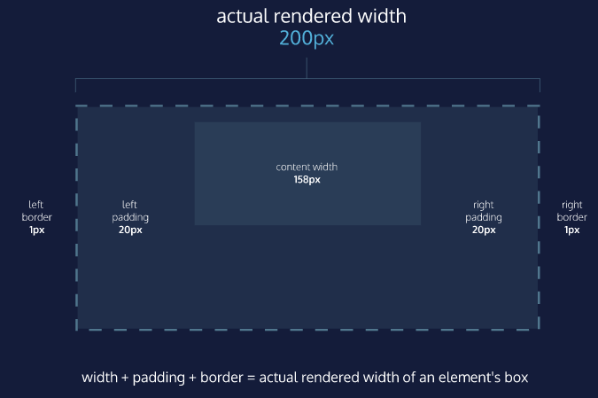
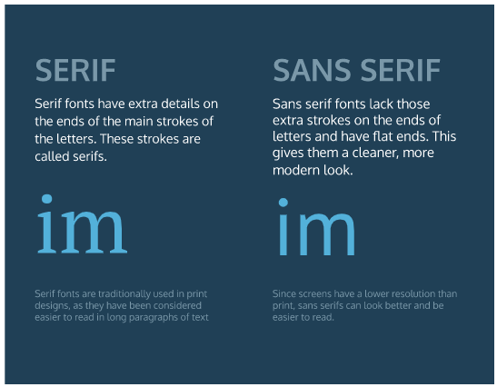

# LEARN CSS - CODECADEMY 

[Learn CSS](https://www.codecademy.com/learn/learn-css?language_code=en) - Learn how to style and visually organize HTML with CSS.

## ÍNDICE

[CSS ANATOMY](#css-anatomy)

[SELECTORS](#selectors)

[THE BOX MODEL](#the-box-model)

[CHANGING THE BOX MODEL](#chaging-the-box-model)

[DISPLAY AND POSITIONING](#display-and-positioning)

[COLOR](#color)

[TYPOGRAPHY](#typography)


<h2> <a name = "css-anatomy"></a>CSS ANATOMY </h2>


### Inline Styles

<p style='color:red;'>I'm learning to code!</p>

<p style='color:blue; font-size:30px;'>I'm learning to code!</p>

> It’s important to know that inline styles are a quick way of directly styling an HTML element, but are rarely used when creating websites. 

### Internal Stylesheet

HTML allows you to write CSS code in its own dedicated section with a element nested inside of the `<head>` element. The CSS code inside the `<style>` element is often referred to as an *internal stylesheet*.

> An internal stylesheet has certain benefits and use cases over inlines styles, but once again, it’s not best practice. 

To create an internal stylesheet:

```html
<head>
  <style>
    p {
      color: red;
      font-size: 20px;
    }
  </style>
</head>
```

### External Stylesheet

Developers avoid mixing code by storing HTML and CSS code in separate files (HTML files contain only HTML code, and CSS files contain only CSS code).

You can create an external stylesheet by using the **.css** file name extension, like so: **style.css**

When HTML and CSS codes are in separate files, the files must be linked.

You can use the `<link>` element to link HTML and CSS files together. The `<link>` element must be placed within the head of the HTML file. It is a self-closing tag and requires the following attributes:

1. `href` — like the anchor element, the value of this attribute must be the address, or path, to the CSS file.
2. `rel` — this attribute describes the relationship between the HTML file and the CSS file. Because you are linking to a stylesheet, the value should be set to `stylesheet`.


```html
<link href='./style.css' rel='stylesheet'>
```


<h2> <a name = "selectors"></a>SELECTORS</h2>

### Type

A selector is used to target the specific HTML element(s) to be styled by the declaration. One selector you may already be familiar with is the *type* selector. Just like its name suggests, the type selector matches the *type* of the element in the HTML document.

```css
p {
  color: green;
}
```

The element type is `p`, which comes from the HTML `<p>` tag.

> Since element types are often referred to by their opening tag name, the type selector is sometimes referred to as the *tag name* or *element* selector.

### Universal

You learned how the *type selector* selects all elements of a given type. Well, the *universal selector* selects all elements of *any* type.

Targeting all of the elements on the page has a few specific use cases, such as resetting default browser styling, or selecting all children of a parent element.

The universal selector uses the `*` character in the same place where you specified the type selector in a ruleset, like so:

```css
* { 
  font-family: 'Verdana';
}
```

### Class

CSS is not limited to selecting elements by their type. As you know, HTML elements can also have attributes. When working with HTML and CSS a *class* attribute is one of the most common ways to select an element.

```html
<p class='brand'>Sole Shoe Company</p>
```

To select an HTML element by its class using CSS, a period (`.`) must be prepended to the class’s name.

```css
.brand {

}
```

### Multiple Classes

We can use CSS to select an HTML element’s `class` attribute by name. And so far, we’ve selected elements using only one class name per element. If every HTML element had a single class, all the style information for each element would require a new class.

Luckily, it’s possible to add more than one class name to an HTML element’s `class` attribute.

For instance, perhaps there’s a heading element that needs to be green and bold. You could write two CSS rulesets like so:

```css
.green {
  color: green;
}
 
.bold {
  font-weight: bold;
}
```

Then, you could include both of these classes on one HTML element like this:

```html
<h1 class='green bold'> ... </h1>
```

We can add multiple classes to an HTML element’s `class` attribute by separating them with a space. This enables us to mix and match CSS classes to create many unique styles without writing a custom class for every style combination needed.

### ID

Oftentimes it’s important to select a single element with CSS to give it its own unique style. If an HTML element needs to be styled uniquely, we can give it an ID using the `id` attribute.

```html
<h1 id='large-title'> ... </h1>
```

In contrast to `class` which accepts multiple values, and can be used broadly throughout an HTML document, an element’s `id` can only have a single value, and only be used once per page.

To select an element’s ID with CSS, we prepend the `id` name with a number sign (`#`). 

```css
#large-title {
 
}
```

### Attribute

You may remember that some HTML elements use attributes to add extra detail or functionality to the element. Some familiar attributes may be `href` and `src`, but there are [many more](https://developer.mozilla.org/en-US/docs/Web/HTML/Attributes)—including `class` and `id`!

The *attribute selector* can be used to target HTML elements that already contain attributes. Elements of the same type can be targeted differently by their attribute or attribute value. This alleviates the need to add new code, like the `class` or `id` attributes.

Attributes can be selected similarly to types, classes, and IDs.

```css
[href]{
    color: magenta;
}
```

The most basic syntax is an attribute surrounded by square brackets. In the above example: `[href]` would target all elements with an `href` attribute and set the `color` to `magenta`.

And it can get [more granular](https://developer.mozilla.org/en-US/docs/Web/CSS/Attribute_selectors#syntax) from there by adding type and/or attribute values. One way is by using `type[attribute*=value]`. In short, this code selects an element where the attribute contains any instance of the specified value. Let’s take a look at an example.

```html


```

The HTML code above renders two `` elements, each containing a `src` attribute with a value equaling a link to an image file.

```css
img[src*='winter'] {
  height: 50px;
}
 
img[src*='summer'] {
  height: 100px;
}
```

Now take a look at the above CSS code. The *attribute selector* is used to target each image individually.

- The first ruleset looks for an `img` element with an attribute of `src` that contains the string `'winter'`, and sets the `height` to `50px`.
- The second ruleset looks for an `img` element with an attribute of `src` that contains the string `'summer'`, and sets the `height` to `100px`.

Notice how no new HTML markup (like a class or id) needed to be added, and we were still able to modify the styles of each image independently. This is one advantage to using the attribute selector!

### Pseudo-class

You may have observed how the appearance of certain elements can change, or be in a different state, after certain user interactions. For instance:

- When you click on an `<input>` element, and a blue border is added showing that it is in *focus*.
- When you click on a blue `<a>` link to *visit* to another page, but when you return the link’s text is purple.
- When you’re filling out a form and the submit button is grayed out and *disabled*. But when all of the fields have been filled out, the button has color showing that it’s *active*.

These are all examples of pseudo-class selectors in action! In fact, `:focus`, `:visited`, `:disabled`, and `:active` are all pseudo-classes. Factors such as user interaction, site navigation, and position in the DOM can all give elements a different state with pseudo-class.

A pseudo-class can be attached to any selector. It is always written as a colon `:` followed by a name. For example:

```css
p:hover {
  background-color: lime;
}
```

### Classes and IDs

CSS can select HTML elements by their type, class, and ID. CSS classes and IDs have different purposes, which can affect which one you use to style HTML elements.

CSS classes are meant to be reused over many elements. By writing CSS classes, you can style elements in a variety of ways by mixing classes. For instance, imagine a page with two headlines. One headline needs to be bold and blue, and the other needs to be bold and green. Instead of writing separate CSS rules for each headline that repeat each other’s code, it’s better to write a `.bold` CSS rule, a `.green` CSS rule, and a `.blue` CSS rule. Then you can give one headline the `bold green` classes, and the other the `bold blue` classes.

While classes are meant to be used many times, an ID is meant to style only one element. IDs override the styles of types and classes. Since IDs override these styles, they should be used sparingly and only on elements that need to always appear the same.

### Specificity

Specificity is the order by which the browser decides which CSS styles will be displayed. A best practice in CSS is to style elements while using the lowest degree of specificity so that if an element needs a new style, it is easy to override.

IDs are the most specific selector in CSS, followed by classes, and finally, type.

To make styles easy to edit, it’s best to style with a type selector, if possible. If not, add a class selector. If that is not specific enough, then consider using an ID selector.

### Chaining

When writing CSS rules, it’s possible to require an HTML element to have two or more CSS selectors at the same time.

This is done by combining multiple selectors, which we will refer to as chaining. For instance, if there was a `special` class for `<h1>` elements, the CSS would look like below:

```css
h1.special{

}
```

The code above would select only the `<h1>` elements with a class of `special`. If a `<p>` element also had a class of `special`, the rule in the example would not style the paragraph.

### Descendant Combinator

In addition to chaining selectors to select elements, CSS also supports selecting elements that are nested within other HTML elements, also known as *descendants*. For instance, consider the following HTML:

```html
<ul class='main-list'>
  <li> ... </li>
  <li> ... </li>
  <li> ... </li>
</ul>
```

The nested `<li>` elements are descendants of the `<ul>` element and can be selected with the *descendant combinator* like so:

```css
.main-list li {
 
}
```

In the example above, `.main-list` selects the element with the`.main-list` class (the `<ul>` element). The descendant `<li>`‘s are selected by adding `li` to the selector, separated by a space. This results in `.main-list li` as the final selector.

Selecting elements in this way can make our selectors even more specific by making sure they appear in the context we expect.

### Chaining and Specificity

Adding more than one tag, class, or ID to a CSS selector increases the specificity of the CSS selector.

For instance, consider the following CSS: 

```css
p {
  color: blue;
}
 
.main p {
  color: red;
}
```

Both of these CSS rules define what a `<p>` element should look like. Since `.main p` has a class and a `p` type as its selector, only the `<p>` elements inside the `.main` element will appear `red`. This occurs despite there being another more general rule that states `<p>` elements should be `blue`.

### Multiple Selectors

In order to make CSS more concise, it’s possible to add CSS styles to multiple CSS selectors all at once. This prevents writing repetitive code.

For instance, the following code has repetitive style attributes:

```css
h1 {
  font-family: 'Georgia';
}
 
.menu {
  font-family: 'Georgia';
}
```

Instead of writing `font-family: Georgia` twice for two selectors, we can separate the selectors by a comma to apply the same style to both, like this:

```css
h1, 
.menu {
  font-family: 'Georgia';
}
```

By separating the CSS selectors with a comma, both the `<h1>` elements and the elements with the `menu` class will receive the `font-family: Georgia` styling.


<h2> <a name = "the-box-model"></a>THE BOX MODEL</h2>

Browsers load HTML elements with default position values. This often leads to an unexpected and unwanted user experience while limiting the views you can create. In this lesson, you will learn about the *box model*, an important concept to understand how elements are positioned and displayed on a website.

If you have used HTML and CSS, you have unknowingly seen aspects of the box model. For example, if you have set the background color of an element, you may have noticed that the color was applied not only to the area directly behind the element but also to the area to the right of the element. Also, if you have aligned text, you know it is aligned relative to something. What is that something?

All elements on a web page are interpreted by the browser as “living” inside of a box. This is what is meant by the box model.

For example, when you change the background color of an element, you change the background color of its entire box.


The box model comprises the set of properties that define parts of an element that take up space on a web page. The model includes the content area’s size (*width* and *height*) and the element’s *padding*, *border*, and *margin*. The properties include:

1. `width` and `height`: The width and height of the content area.
2. `padding`: The amount of space between the content area and the border.
3. `border`: The thickness and style of the border surrounding the content area and padding.
4. `margin`: The amount of space between the border and the outside edge of the element.

### Height and Width

An element’s content has two dimensions: a height and a width. By default, the dimensions of an HTML box are set to hold the raw contents of the box.

The CSS `height` and `width` properties can be used to modify these default dimensions.

```css
p {
  height: 80px;
  width: 240px;
}
```

In this example, the `height` and `width` of paragraph elements are set to 80 pixels and 240 pixels, respectively — the `px` in the code above stands for *pixels*.

Pixels allow you to set the exact size of an element’s box (width and height). When the width and height of an element are set in pixels, it will be the same size on all devices — an element that fills a laptop screen will overflow a mobile screen.

### Borders

A *border* is a line that surrounds an element, like a frame around a painting. Borders can be set with a specific `width`, `style`, and `color`:

- `width`—The thickness of the border. A border’s thickness can be set in pixels or with one of the following keywords: `thin`, `medium`, or `thick`.
- `style`—The design of the border. Web browsers can render any of [10 different styles](https://developer.mozilla.org/en-US/docs/Web/CSS/border-style#Values). Some of these styles include: `none`, `dotted`, and `solid`.
- `color`—The color of the border. Web browsers can render colors using a few different formats, including [140 built-in color keywords](https://developer.mozilla.org/en-US/docs/Web/CSS/color_value).

```css
p {
  border: 3px solid coral;
}
```

In the example above, the border has a width of 3 pixels, a style of `solid`, and a color of `coral`. All three properties are set in one line of code.

The default border is `medium none color`, where `color` is the current color of the element. If `width`, `style`, or `color` are not set in the CSS file, the web browser assigns the default value for that property.

```css
p.content-header {
  height: 80px;
  width: 240px;
  border: solid coral;
}
```

In this example, the border style is set to `solid` and the color is set to `coral`. The width is not set, so it defaults to `medium`.

### Border Radius

You can modify the corners of an element’s border box with the `border-radius` property.

```css
div.container {
  border: 3px solid blue;
  border-radius: 5px;
}
```

The code in the example above will set *all four corners* of the border to a radius of 5 pixels (i.e. the same curvature that a circle with a radius of 5 pixels would have).

You can create a border that is a perfect circle by first creating an element with the same width and height, and then setting the radius equal to half the width of the box, which is 50%.

```css
div.container {
  height: 60px;
  width: 60px;
  border: 3px solid blue;
  border-radius: 50%;
}
```

The code in the example above creates a `<div>` that is a perfect circle.

### Padding

The space between the contents of a box and the borders of a box is known as *padding*. Padding is like the space between a picture and the frame surrounding it. In CSS, you can modify this space with the `padding` property.

```css
p.content-header {
  border: 3px solid coral;
  padding: 10px;
}
```

The code in this example puts 10 pixels of space between the content of the paragraph (the text) and the borders, on all four sides.

The `padding` property is often used to expand the background color and make the content look less cramped.

If you want to be more specific about the amount of padding on each side of a box’s content, you can use the following properties:

- `padding-top`
- `padding-right`
- `padding-bottom`
- `padding-left`

Each property affects the padding on only one side of the box’s content, giving you more flexibility in customization.

### Padding Shorthand

Another implementation of the `padding` property lets you specify exactly how much padding there should be on each side of the content in a single declaration. A declaration that uses multiple properties as values is known as a *shorthand property*.

Padding shorthand lets you specify all of the `padding` properties as values on a single line:

- `padding-top`
- `padding-right`
- `padding-bottom`
- `padding-left`

You can specify these properties in a few different ways:

**4 Values**

```css
p.content-header {
  padding: 6px 11px 4px 9px;
}
```

In the example above, the four values `6px 11px 4px 9px` correspond to the amount of padding on each side, in a clockwise rotation. In order, it specifies the padding-top value (`6px`), the padding-right value (`11px`), the padding-bottom value (`4px`), and the padding-left value (`9px`) of the content.

**3 Values**

```css
p.content-header {
  padding: 5px 10px 20px;
}
```

If the left and right sides of the content can be equal, the padding shorthand property allows for 3 values to be specified. The first value sets the padding-top value (`5px`), the second value sets the padding-left and padding-right values (`10px`), and the third value sets the padding-bottom value (`20px`).

**2 Values**

```css
p.content-header {
  padding: 5px 10px;
}
```

And finally, if the top and bottom sides can be equal, and the left and right sides can be equal, you can specify 2 values. The first value sets the padding-top and padding-bottom values (`5px`), and the second value sets the padding-left and padding-right values (`10px`).

### Margin

Margin refers to the space directly outside of the box. The `margin` property is used to specify the size of this space.

```css
p {
  border: 1px solid aquamarine;
  margin: 20px;
}
```

The code in the example above will place 20 pixels of space on the outside of the paragraph’s box on all four sides. This means that other HTML elements on the page cannot come within 20 pixels of the paragraph’s border.

If you want to be even more specific about the amount of margin on each side of a box, you can use the following properties:

- `margin-top`
- `margin-right`
- `margin-bottom`
- `margin-left`

Each property affects the margin on only one side of the box, providing more flexibility in customization.

### Margin Auto

The `margin` property also lets you center content. However, you must follow a few syntax requirements. Take a look at the following example:

```css
div.headline {
  width: 400px;
  margin: 0 auto;
}
```

In the example above, `margin: 0 auto;` will center the divs in their containing elements. The 0 sets the top and bottom margins to 0 pixels. The `auto` value instructs the browser to adjust the left and right margins until the element is centered within its containing element.

In order to center an element, a width must be set for that element. Otherwise, the width of the div will be automatically set to the full width of its containing element, like the `<body>`, for example. It’s not possible to center an element that takes up the full width of the page, since the width of the page can change due to display and/or browser window size.

In the example above, the width of the `div` is set to 400 pixels, which is less than the width of most screens. This will cause the div to center within a containing element that is greater than 400 pixels wide.

### Margin Collapse

As you have seen, padding is space added inside an element’s border, while margin is space added outside an element’s border. One additional difference is that top and bottom margins, also called vertical margins, *collapse*, while top and bottom padding does not.


Horizontal margins (left and right), like padding, are always displayed and added together. For example, if two divs with ids `#div-one` and `#div-two`, are next to each other, they will be as far apart as the sum of their adjacent margins.

```css
#img-one {
  margin-bottom: 30px;
}
 
#img-two {
  margin-top: 20px;
}
```

In this example, the vertical margin between the `#img-one` and `#img-two` elements is 30 pixels. Although the sum of the margins is 50 pixels, the margin collapses so the spacing is only dependent on the `#img-one` bottom margin.

It may be helpful to think of collapsing vertical margins as a short person trying to push a taller person. The tall person has longer arms and can easily push the short person, while the person with short arms cannot reach the person with long arms.

### Minimum and Maximum Height and Width

Because a web page can be viewed through displays of differing screen size, the content on the web page can suffer from those changes in size. To avoid this problem, CSS offers two properties that can limit how narrow or how wide an element’s box can be sized to:

- `min-width`—this property ensures a minimum width of an element’s box.
- `max-width`—this property ensures a maximum width of an element’s box.

```css
p {
  min-width: 300px;
  max-width: 600px;
}
```

In the example above, the width of all paragraphs will not shrink below 300 pixels, nor will the width exceed 600 pixels.

Content, like text, can become difficult to read when a browser window is narrowed or expanded. These two properties ensure that content is legible by limiting the minimum and maximum widths of an element.

You can also limit the minimum and maximum *height* of an element:

- `min-height` — this property ensures a minimum height for an element’s box.
- `max-height` — this property ensures a maximum height of an element’s box.

```css
p {
  min-height: 150px;
  max-height: 300px;
}
```

In the example above, the height of all paragraphs will not shrink below 150 pixels and the height will not exceed 300 pixels.

What will happen to the contents of an element’s box if the `max-height` property is set too low? It’s possible for the content to spill outside of the box, resulting in content that is not legible. 

### Overflow

All of the components of the box model comprise an element’s size. For example, an image that has the following dimensions is 364 pixels wide and 244 pixels tall.

- 300 pixels wide
- 200 pixels tall
- 10 pixels padding on the left and right
- 10 pixels padding on the top and bottom
- 2 pixels border on the left and right
- 2 pixels border on the top and bottom
- 20 pixels margin on the left and right
- 10 pixels margin on the top and bottom

The total dimensions (364px by 244px) are calculated by adding all of the vertical dimensions together and all of the horizontal dimensions together. Sometimes, these components result in an element that is larger than the parent’s containing area.

How can we ensure that we can view all of an element that is larger than its parent’s containing area?

The `overflow` property controls what happens to content that spills, or overflows, outside its box. The most commonly used values are:

- `hidden`—when set to this value, any content that overflows will be hidden from view.
- `scroll`—when set to this value, a scrollbar will be added to the element’s box so that the rest of the content can be viewed by scrolling.
- `visible`—when set to this value, the overflow content will be displayed outside of the containing element. **Note, this is the default value.**

```css
p {
  overflow: scroll; 
}
```

In the example above, if any of the paragraph content overflows (perhaps a user resizes their browser window), a scrollbar will appear so that users can view the rest of the content.

The overflow property is set on a parent element to instruct a web browser on how to render child elements. For example, if a div’s overflow property is set to `scroll`, all children of this div will display overflowing content with a scroll bar.

For a more in-depth look at `overflow`, including additional properties like `overflow-x` and `overflow-y` that separate out the horizontal and vertical values, head over to the MDN [documentation](https://developer.mozilla.org/en-US/docs/Web/CSS/overflow).

### Resetting Defaults

All major web browsers have a default stylesheet they use in the absence of an external stylesheet. These default stylesheets are known as *user agent stylesheets*. In this case, the term *[user agent](https://en.wikipedia.org/wiki/User_agent)* is a technical term for the browser.

User agent stylesheets often have default CSS rules that set default values for padding and margin. This affects how the browser displays HTML elements, which can make it difficult for a developer to design or style a web page.

Many developers choose to reset these default values so that they can truly work with a clean slate.

```css
* {
  margin: 0;
  padding: 0;
}
```

The code in the example above resets the default margin and padding values of all HTML elements. It is often the first CSS rule in an external stylesheet.

> Note that both properties are both set to `0`. When these properties are set to `0`, they do not require a unit of measurement.

### Visibility

Elements can be hidden from view with the `visibility` property.

The `visibility` property can be set to one of the following values:

- `hidden` — hides an element.
- `visible` — displays an element.
- `collapse` — collapses an element.

```html
<ul>
  <li>Explore</li>
  <li>Connect</li>
  <li class="future">Donate</li>
</ul>
```

```css
.future {
  visibility: hidden;
}
```

In the example above, the list item with a class of `future` will be hidden from view in the browser.

Keep in mind, however, that users can still view the contents of the list item (e.g., `Donate`) by viewing the source code in their browser. Furthermore, the web page will *only* hide the contents of the element. It will still leave an empty space where the element is intended to display.

> **Note:** What’s the difference between `display: none` and `visibility: hidden`? An element with `display: none` will be completely removed from the web page. An element with `visibility: hidden`, however, will not be visible on the web page, but the space reserved for it will.


<h2> <a name = "changing-the-box-model"></a>CHANGING THE BOX MODEL </h2>

The last lesson focused on the most important aspects of the box model: box dimensions, borders, padding, and margin.

The box model, however, has an awkward limitation regarding box dimensions. This limitation is best illustrated with an example.

```html
<h1>Hellow World</h1>
```

```css
h1 {
  border: 1px solid black;
  height: 200px;
  width: 300px;
  padding: 10px;
}
```

In the example above, a heading element’s box has solid, black, 1 pixel thick borders. The height of the box is 200 pixels, while the width of the box is 300 pixels. A padding of 10 pixels has also been set on all four sides of the box’s content.

Unfortunately, under the current box model, the border thickness and the padding will affect the dimensions of the box.

The 10 pixels of padding increases the height of the box to 220 pixels and the width to 320 pixels. Next, the 1-pixel thick border increases the height to 222 pixels and the width to 322 pixels.

Under this box model, the border thickness and padding are added to the overall dimensions of the box. This makes it difficult to accurately size a box. Over time, this can also make all of a web page’s content difficult to position and manage.

### Box-Model: Content-Box



Many properties in CSS have a default value and don’t have to be explicitly set in the stylesheet.

For example, the default `font-weight` of text is `normal`, but this property-value pair is not typically specified in a stylesheet.

The same can be said about the box model that browsers assume. In CSS, the `box-sizing` property controls the type of box model the browser should use when interpreting a web page.

The default value of this property is `content-box`. This is the same box model that is affected by border thickness and padding.

### Box Model: Border-Box


Fortunately, we can reset the entire box model and specify a new one: `border-box`.

```css
* {
  box-sizing: border-box;
}
```

The code in the example above resets the box model to `border-box` for all HTML elements. This new box model avoids the dimensional issues that exist in the former box model you learned about.

In this box model, the height and width of the box will remain fixed. The border thickness and padding will be included inside of the box, which means the overall dimensions of the box do not change.

```html
<h1>
    Hello World
</h1>
```

```css
* {
  box-sizing: border-box;
}
 
h1 {
  border: 1px solid black;
  height: 200px;
  width: 300px;
  padding: 10px;
}
```

In the example above, the height of the box would remain at 200 pixels and the width would remain at 300 pixels. The border thickness and padding would remain entirely *inside* of the box.


<h2> <a name = "display-and-positioning"></a>DISPLAY AND POSITIONING</h2>

### Flow of HTML

A browser will render the elements of an HTML document that has no CSS from left to right, top to bottom, in the same order as they exist in the document. This is called the *flow* of elements in HTML.

In addition to the properties that it provides to style HTML elements, CSS includes properties that change how a browser *positions* elements. These properties specify where an element is located on a page, if the element can share lines with other elements, and other related attributes.

There are five properties for adjusting the position of HTML elements in the browser:

- `position`
- `display`
- `z-index`
- `float`
- `clear`

Each of these properties will allow us to position and view elements on a web page. They can be used in conjunction with any other styling properties you may know.

### Position

Take a look at the *block-level* elements in the image below:


Block-level elements like these boxes create a *block* the full width of their parent elements, and they prevent other elements from appearing in the same horizontal space.

Notice the block-level elements in the image above take up their own line of space and therefore don’t overlap each other. In the browser to the right, you can see block-level elements also consistently appear on the left side of the browser. This is the default *position* for block-level elements.

The default position of an element can be changed by setting its `position` property. The `position` property can take one of five values:

- `static` - the default value (it does not need to be specified)
- `relative`
- `absolute`
- `fixed`
- `sticky`

### Position: Relative

One way to modify the default position of an element is by setting its `position` property to `relative`.

This value allows you to position an element *relative* to its default static position on the web page.

```css
.green-box {
  background-color: green;
  position: relative;
}
```

Although the code in the example above instructs the browser to expect a relative positioning of the `.green-box` element, it does not specify where the `.green-box` element should be positioned on the page. This is done by accompanying the `position` declaration with one or more of the following *offset properties* that will move the element away from its default static position:

- `top` - moves the element down from the top.
- `bottom` - moves the element up from the bottom.
- `left` - moves the element away from the left side (to the right).
- `right` - moves the element away from the right side (to the left).

You can specify values in pixels, ems, or percentages, among others, to dial in exactly how far you need the element to move. It’s also important to note that offset properties will not work if the element’s `position` property is the default `static`.

```css
.green-box {
  background-color: green;
  position: relative;
  top: 50px;
  left: 120px;
}
```

In the example above, the element of `green-box` class will be moved down 50 pixels, and to the right 120 pixels, from its default static position. The image below displays the new position of the box.


Offsetting the relative element will not affect the positioning of other elements.

### Position: Absolute

Another way of modifying the position of an element is by setting its position to `absolute`.

When an element’s position is set to `absolute`, all other elements on the page will ignore the element and act like it is not present on the page. The element will be positioned relative to its closest positioned parent element, while offset properties can be used to determine the final position from there. Take a look at the image below:


The “Website building in progress. Please come back later!” text is displaced from its static position at the top left corner of its parent container. It has offset property declarations of `top: 300px;` and `right: 0;`, positioning it 300 pixels down, and 0 pixels from the right side of the page.

### Position: Fixed

When an element’s position is set to `absolute`, as in the last exercise, the element will scroll with the rest of the document when a user scrolls.

We can *fix* an element to a specific position on the page (regardless of user scrolling) by setting its position to `fixed`, and accompanying it with the familiar offset properties `top`, `bottom`, `left`, and `right`.

```css
.title {
  position: fixed;
  top: 0px;
  left: 0px;
}
```

In the example above, the `.title` element will remain fixed to its position no matter where the user scrolls on the page. This technique is often used for navigation bars on a web page.

### Position: Sticky

Since `static` and `relative` positioned elements stay in the normal flow of the document, when a user scrolls the page (or parent element) these elements will scroll too. And since `fixed` and `absolute` positioned elements are removed from the document flow, when a user scrolls, these elements will stay at their specified offset position.

The `sticky` value is another position value that keeps an element in the document flow as the user scrolls, but *sticks* to a specified position as the page is scrolled further. This is done by using the `sticky` value along with the familiar offset properties, as well as one new one.

```css
.box-bottom {
  background-color: darkgreen;
  position: sticky;
  top: 240px;
}
```

In the example above, the `.box-bottom` `<div>` will remain in its relative position, and scroll as usual. When it reaches 240 pixels from the top, it will stick to that position until it reaches the bottom of its parent container where it will “unstick” and rejoin the flow of the document.

### Z-Index

When boxes on a web page have a combination of different positions, the boxes (and therefore, their content) can overlap with each other, making the content difficult to read or consume.

```css
.blue-box {
  background-color: blue;
}
 
.green-box {
  background-color: green;
  position: relative;
  top: -170px;
  left: 170px;
}
```

In the example above, the `.green-box` element overlaps on top of the `.blue-box` element.

The `z-index` property controls how far back or how far forward an element should appear on the web page when elements overlap. This can be thought of as the *depth* of elements, with deeper elements appearing behind shallower elements.

The `z-index` property accepts integer values. Depending on their values, the integers instruct the browser on the order in which elements should be layered on the web page.

```css
.blue-box {
  background-color: blue;
  position: relative;
  z-index: 1;
}
 
.green-box {
  background-color: green;
  position: relative;
  top: -170px;
  left: 170px;
}
```

In the example above, we set the `.blue-box` position to `relative` and the z-index to 1. We changed position to `relative`, because the `z-index` property does *not* work on static elements. The z-index of `1` moves the `.blue-box` element forward, because the `z-index` value has not been explicitly specified for the `.green-box` element, which means it has a default `z-index` value of 0. Take a look the example image below:


### Inline Display

Every HTML element has a default `display` value that dictates if it can share horizontal space with other elements. Some elements fill the entire browser from left to right regardless of the size of their content. Other elements only take up as much horizontal space as their content requires and can be directly next to other elements.

There are three values for the `display` property: `inline`, `block`, and `inline-block`.

The default `display` for some elements, such as `<em>`, `<strong>`, and `<a>`, is called *inline*. Inline elements have a box that wraps tightly around their content, only taking up the amount of space necessary to display their content and not requiring a new line after each element. The height and width of these elements cannot be specified in the CSS document. For example, the text of an anchor tag (`<a>`) will, by default, be displayed on the same line as the surrounding text, and it will only be as wide as necessary to contain its content. `inline` elements cannot be altered in size with the `height` or `width` CSS properties.

```html
To learn more about <em>inline</em> elements, read <a href="#">MDN documentation</a>.  
```

In the example above, the `<em>` element is `inline`, because it displays its content on the same line as the content surrounding it, including the anchor tag. This example will display:

To learn more about *inline* elements, read [MDN documentation](https://developer.mozilla.org/en-US/docs/Web/HTML/Inline_elements).

The CSS `display` property provides the ability to make any element an inline element. This includes elements that are not inline by default such as paragraphs, divs, and headings.

```css
h1 {
  display: inline;
}
```

The CSS in the example above will change the display of all `<h1>` elements to `inline`. The browser will render `<h1>` elements on the same line as other inline elements immediately before or after them (if there are any).

### Display: Block

Some elements are not displayed in the same line as the content around them. These are called *block-level* elements. These elements fill the entire width of the page by default, but their `width` property can also be set. Unless otherwise specified, they are the height necessary to accommodate their content.

Elements that are block-level by default include all levels of heading elements (`<h1>` through `<h6>`), `<p>`, `<div>` and `<footer>`. For a complete list of block level elements, visit [the MDN documentation](https://developer.mozilla.org/en-US/docs/Web/HTML/Block-level_elements).

```css
strong {
  display: block;
}
```

In the example above, all `<strong>` elements will be displayed on their own line, with no content directly on either side of them even though their contents may not fill the width of most computer screens.

### Display: Inline-Block

The third value for the `display` property is `inline-block`. Inline-block display combines features of both inline and block elements. Inline-block elements can appear next to each other and we can specify their dimensions using the `width` and `height` properties. Images are the best example of default inline-block elements.

For example, the `<div>`s below will be displayed on the same line and with the specified dimensions:


Let’s take a look at the code:

```html
<div class="rectangle">
  <p>I’m a rectangle!</p>
</div>
<div class="rectangle">
  <p>So am I!</p>
</div>
<div class="rectangle">
  <p>Me three!</p>
</div>
```

```css
.rectangle {
  display: inline-block;
  width: 200px;
  height: 300px;
}
```

There are three rectangular divs that each contain a paragraph of text. The `.rectangle` `<div>`s will all appear inline (provided there is enough space from left to right) with a width of 200 pixels and height of 300 pixels, even though the text inside of them may not require 200 pixels by 300 pixels of space.

### Float

So far, you’ve learned how to specify the exact position of an element using offset properties. If you’re simply interested in moving an element as far left or as far right as possible in the container, you can use the `float` property.

The `float` property is commonly used for wrapping text around an image while moving elements left and right for layout purposes is better left to tools like CSS grid and flexbox, which you’ll learn about later on.

The `float` property is often set using one of the values below:

- `left` - moves, or floats, elements as far left as possible.
- `right` - moves elements as far right as possible.

```css
.green-section {
  width: 50%;
  height: 150px;
}
 
.orange-section {
  background-color: orange;
  width: 50%;
  float: right;
}
```

In the example above, we float the `.orange-section` element to the `right`. This works for static and relative positioned elements. See the result of the code below:


Floated elements must have a width specified, as in the example above. Otherwise, the element will assume the full width of its containing element, and changing the float value will not yield any visible results.

### Clear

The `float` property can also be used to float multiple elements at once. However, when multiple floated elements have different heights, it can affect their layout on the page. Specifically, elements can “bump” into each other and not allow other elements to properly move to the left or right.

The `clear` property specifies how elements should behave when they bump into each other on the page. It can take on one of the following values:

- `left`—the left side of the element will not touch any other element within the same containing element.
- `right`—the right side of the element will not touch any other element within the same containing element.
- `both`—neither side of the element will touch any other element within the same containing element.
- `none`—the element can touch either side.

```css
div {
  width: 200px;
  float: left;
}
 
div.special {
  clear: left;
}
```

In the example above, all `<div>`s on the page are floated to the left side. The element with class `special` did not move all the way to the left because a taller `<div>` blocked its positioning. By setting its `clear` property to `left`, the `special` `<div>` will be moved all the way to the left side of the page.


<h2> <a name = "color"></a>COLOR</h2>

### Hexadecimal

One syntax that we can use to specify colors is called *hexadecimal*. Colors specified using this system are called *hex colors*. A hex color begins with a hash character (`#`) which is followed by three or six characters. The characters represent values for red, blue and green.

```css
darkseagreen: #8FBC8F
sienna:       #A0522D
saddlebrown:  #8B4513
brown:        #A52A2A
black:        #000000 or #000
white:        #FFFFFF or #FFF
aqua:         #00FFFF or #0FF
```

In the example above, you may notice that there are both letters and numbers in the values. This is because the hexadecimal number system has 16 digits (0-15) instead of 10 (0-9) like in the standard decimal system. To represent 10-15, we use A-F. [Here](https://developer.mozilla.org/en-US/docs/Web/CSS/color_value) is a list of many different colors and their hex values.

Notice that `black`, `white`, and `aqua` are all represented with both three characters and six characters. This can be done with hex colors whose number pairs are the same characters. In the example above, `aqua` can be represented as `#0FF` because both of the first two characters are `0` and the second and third pairs of characters are both `F`s. Keep in mind that all three character hex colors can be represented with six characters (by repeating each character twice) but the same is not true in reverse.

You can include hex colors just as you would include named colors: `background-color: #9932cc;`, and the letters can be uppercase or lowercase.

### RGB Colors

There is another syntax for representing RGB values, commonly referred to as “RGB value” or just “RGB”, that uses decimal numbers rather than hexadecimal numbers, and it looks like this:

```css
h1 {
  color: rgb(23, 45, 23);
}
```

Each of the three values represents a color component, and each can have a decimal number value from 0 to 255. The first number represents the amount of red, the second is green, and the third is blue. These colors are exactly the same as hex, but with a different syntax and a different number system.

In general, hex and RGB color representations are equivalent. Which you choose is a matter of personal taste. 

> That said, it’s good to choose one and be consistent throughout your CSS, because it’s easier to compare hex to hex and RGB to RGB.

### Hue, Saturation, and Lightness

The RGB color scheme is convenient because it’s very close to how computers represent colors internally. There’s another equally powerful system in CSS called the hue-saturation-lightness color scheme, abbreviated as *HSL*.

The syntax for HSL is similar to the decimal form of RGB, though it differs in important ways. The first number represents the degree of the hue, and can be between 0 and 360. The second and third numbers are percentages representing saturation and lightness respectively. Here is an example:

```css
color: hsl(120, 60%, 70%);
```

*Hue* is the first number. It refers to an angle on a color wheel. Red is 0 degrees, Green is 120 degrees, Blue is 240 degrees, and then back to Red at 360. You can see an example of a color wheel below.


*Saturation* refers to the intensity or purity of the color. The saturation increases towards 100% as the color becomes richer. The saturation decreases towards 0% as the color becomes grayer.

*Lightness* refers to how light or dark the color is. Halfway, or 50%, is normal lightness. Imagine a sliding dimmer on a light switch that starts halfway. Sliding the dimmer up towards 100% makes the color lighter, closer to white. Sliding the dimmer down towards 0% makes the color darker, closer to black.

HSL is convenient for adjusting colors. In RGB, making the color a little darker may affect all three color components. In HSL, that’s as easy as changing the lightness value. HSL is also useful for making a set of colors that work well together by selecting various colors that have the same lightness and saturation but different hues.

### Opacity and Alpha

All of the colors we’ve seen so far have been opaque, or non-transparent. When we overlap two opaque elements, nothing from the bottom element shows through the top element. 

To use opacity in the HSL color scheme, use `hsla` instead of `hsl`, and four values instead of three. For example:

```css
color: hsla(34, 100%, 50%, 0.1);
```

The first three values work the same as `hsl`. The fourth value is the *alpha*. This last value is sometimes called opacity. Alpha is a decimal number from zero to one. If alpha is zero, the color will be completely transparent. If alpha is one, the color will be opaque. The value for half-transparent would be `0.5`.

You can think of the alpha value as, “the amount of the background to mix with the foreground”. When a color’s alpha is below one, any color behind it will be blended in. The blending happens for each pixel; no blurring occurs.

The RGB color scheme has a similar syntax for opacity, `rgba`. Again, the first three values work the same as `rgb` and the last value is the alpha. Here’s an example:

```css
color: rgba(234, 45, 98, 0.33);
```

A little unconventional, but still worth mentioning is how hex colors can also have an alpha value. By adding a two-digit hexadecimal value to the end of the six-digit representation (`#52BC8280`), or a one-digit hexadecimal value to the end of the three-digit representation (#F003), you can change the opacity of a hexadecimal color. Hex opacity ranges from `00` (transparent) to `FF` (opaque).

Alpha can only be used with HSL, RGB, and hex colors; we cannot add the alpha value to name colors like `green`.

There is, however, a named color keyword for zero opacity, `transparent`. It’s equivalent to `rgba(0, 0, 0, 0)`, and it’s used like any other color keyword:

```css
color: transparent;
```


<h2> <a name = "typography"></a>TYPOGRAPHY</h2>

### Font Family

Let’s talk about some things to keep in mind when setting `font-family` values.

##### Multi-Word Values

When specifying a typeface with multiple words, like Times New Roman, it is recommended to use quotation marks (`' '`) to group the words together, like so:

```css
h1 {
  font-family: 'Times New Roman';
}
```

##### Web Safe Fonts

There is a selection of fonts that will appear the same across all browsers and operating systems. These fonts are referred to as *web safe fonts*. You can check out a complete list of web safe fonts [here](https://www.cssfontstack.com/).

##### Fallback Fonts and Font Stacks

Web safe fonts are good *fallback fonts* that can be used if your preferred font is not available.

```css
h1 {
  font-family: Caslon, Georgia, 'Times New Roman';
}
```

In the example above, Georgia and Times New Roman are fallback fonts to Caslon. When you specify a group of fonts, you have what is known as a *font stack*. A font stack usually contains a list of similar-looking fonts. Here, the browser will first try to use the Caslon font. If that’s not available, it will try to use a similar font, Georgia. And if Georgia is not available, it will try to use Times New Roman.

##### Serif and Sans-Serif

You may be wondering what features make a font similar to another font. The fonts Caslon, Georgia, and Times New Roman are *Serif* fonts. Serif fonts have extra details on the ends of each letter, as opposed to *Sans-Serif* fonts, which do not have the extra details.



`serif` and `sans-serif` are also keyword values that can be added as a final fallback font if nothing else in the font stack is available.

```css
h1 {
  font-family: Caslon, Georgia, 'Times New Roman', serif;
}
```

In this final example, the font stack has 4 fonts. If the first 3 fonts aren’t available, the browser will use whatever serif font is available on the system.

### Font Weight

In CSS, the `font-weight` property controls how bold or thin text appears. It can be specified with keywords or numerical values.

### Keyword Values

The `font-weight` property can take any one of these keyword values:

- `bold`: Bold font weight.
- `normal`: Normal font weight. This is the default value.
- `lighter`: One font weight lighter than the element’s parent value.
- `bolder`: One font weight bolder than the element’s parent value

### Numerical Values

Numerical values can range from 1 (lightest) to 1000 (boldest), but it is common practice to use increments of 100. A font weight of `400` is equal to the keyword value `normal`, and a font weight of `700` is equal to `bold`.

```css
.left-section {
  font-weight: 700;
}
 
.right-section {
  font-weight: bold; 
}
```

In the example above, text in elements of both `.left-section` and `.right-section` classes will appear bold.

> It’s important to note that not all fonts can be assigned a numeric font weight, and not all numeric font weights are available to all fonts. It’s a good practice to look up the font you are using to see which `font-weight` values are available.

### Text Transformation

Text can also be styled to appear in either all uppercase or lowercase with the `text-transform` property.

```css
h1 {
  text-transform: uppercase;
}
```

The code in the example above formats all `<h1>` elements to appear in `uppercase`, regardless of the case used for the heading within the HTML code. Alternatively, the `lowercase` value could be used to format text in all lowercase.

Since text can be directly typed in all uppercase or lowercase within an HTML file, what is the point of a CSS rule that allows you to format [letter case](https://en.wikipedia.org/wiki/Letter_case)?

Depending on the type of content a web page displays, it may make sense to always style a specific element in all uppercase or lowercase letters. For example, a website that reports breaking news may decide to format all `<h1>` heading elements such that they always appear in all uppercase, as in the example above. It would also avoid uppercase text in the HTML file, which could make code difficult to read.

### Text Layout

You’ve learned how text can be defined by font family, weight, style, and transformations. Now you’ll learn about some ways text can be displayed or laid out within the element’s container.

##### Letter Spacing

The `letter-spacing` property is used to set the horizontal spacing between the individual characters in an element. It’s not common to set the spacing between letters, but it can sometimes help the readability of certain fonts or styles. The `letter-spacing` property takes length values in units, such as `2px` or `0.5em`.

```css
p {
  letter-spacing: 2px;
}
```

##### Word Spacing

You can set the space between words with the `word-spacing` property. It’s also not common to increase the spacing between words, but it may help enhance the readability of bolded or enlarged text. The `word-spacing` property also takes length values in units, such as `3px` or `0.2em`.

```css
h1 {
  word-spacing: 0.3em;
}
```

In the example above, the word spacing is set to `0.3em`. For word spacing, using `em` values are recommended because the spacing can be set based on the size of the font.

##### Line Height


We can use the `line-height` property to set how tall we want each line containing our text to be. Line height values can be a unitless number, such as `1.2`, or a length value, such as `12px`, `5%` or `2em`.

```css
p {
  line-height: 1.4;
}
```

In the example above, the height between lines is set to `1.4`. 

> Generally, the unitless value is preferred since it is responsive based on the current font size. In other words, if the `line-height` is specified by a unitless number, changing the font size will automatically readjust the line height.

