# LEARN JAVASCRIPT - CODECADEMY :computer:

[Learn JavaScript](https://www.codecademy.com/learn/introduction-to-javascript?language_code=en) - Learn the JavaScript fundamentals you’ll need for front-end or back-end development.

## CONTENTS

[INTRODUCTION TO JAVASCRIPT](#introduction-js)

[VARIABLES](#variables)

[CONDITIONAL STATEMENTS](#conditional-statements)

[FUNCTIONS](#functions)

[SCOPE](#scope)

[ARRAYS](#arrays)

[LOOPS](#loops)

[HIGHER-ORDER FUNCTIONS](#higher-order-functions)

[ITERATORS](#iterators)

<h2> <a name = "introduction-js"></a>INTRODUCTION TO JAVASCRIPT </h2>

### Console

The console is a panel that displays important messages, like errors, for developers. Much of the work the computer does with our code is invisible to us by default. If we want to see things appear on our screen, we can print, or *log*, to our console directly.

In JavaScript, the `console` keyword refers to an object, a collection of data and actions, that we can use in our code. Keywords are words that are built into the JavaScript language, so the computer will recognize them and treats them specially.

One action, or method, that is built into the `console` object is the `.log()` method. When we write `console.log()` what we put inside the parentheses will get printed, or logged, to the console.

It’s going to be very useful for us to print values to the console, so we can see the work that we’re doing.

```javascript
console.log(5);
```

This example logs `5` to the console. The semicolon denotes the end of the line, or statement. Although in JavaScript your code will usually run as intended without a semicolon, we recommend learning the habit of ending each statement with a semicolon so you never leave one out in the few instances when they are required.

### Comments

Comments can explain what the code is doing, leave instructions for developers using the code, or add any other useful annotations.

There are two types of code comments in JavaScript:

1. A *single line comment* will comment out a single line and is denoted with two forward slashes `//` preceding it.

```javascript
// Prints 5 to the console
console.log(5);
```

You can also use a single line comment to comment after a line of code:

```javascript
console.log(5);  // Prints 5 
```

2. A *multi-line comment* will comment out multiple lines and is denoted with `/*` to begin the comment, and `*/` to end the comment.

```javascript
/*
This is all commented 
console.log(10);
None of this is going to run!
console.log(99);
*/
```

You can also use this syntax to comment something out in the middle of a line of code:

```javascript
console.log(/*IGNORED!*/ 5);  // Still just prints 5 
```

### Data Types

*Data types* are the classifications we give to the different kinds of data that we use in programming. In JavaScript, there are seven fundamental data types:

- *Number*: Any number, including numbers with decimals: `4`, `8`, `1516`, `23.42`.
- *String*: Any grouping of characters on your keyboard (letters, numbers, spaces, symbols, etc.) surrounded by single quotes: `' ... '` or double quotes `" ... "`. Though we prefer single quotes. Some people like to think of string as a fancy word for text.
- *Boolean*: This data type only has two possible values— either `true` or `false` (without quotes). It’s helpful to think of booleans as on and off switches or as the answers to a “yes” or “no” question.
- *Null*: This data type represents the intentional absence of a value, and is represented by the keyword `null` (without quotes).
- *Undefined*: This data type is denoted by the keyword `undefined` (without quotes). It also represents the absence of a value though it has a different use than `null`.
- *Symbol*: A newer feature to the language, symbols are unique identifiers, useful in more complex coding. No need to worry about these for now.
- *Object*: Collections of related data.

The first 6 of those types are considered *primitive data types*. They are the most basic data types in the language. *Objects* are more complex. 

```javascript
console.log('Location of Codecademy headquarters: 575 Broadway, New York City');
console.log(40);
```

In the example above, we first printed a string. Our string isn’t just a single word; it includes both capital and lowercase letters, spaces, and punctuation.

Next, we printed the number 40, notice we did not use quotes.

### Arithmetic Operators

An *operator* is a character that performs a task in our code. JavaScript has several built-in *arithmetic operators*, that allow us to perform mathematical calculations on numbers. These include the following operators and their corresponding symbols:

1. Add: `+`
2. Subtract: `-`
3. Multiply: `*`
4. Divide: `/`
5. Remainder: `%`

The first four work how you might guess:

```javascript
console.log(3 + 4); // Prints 7
console.log(5 - 1); // Prints 4
console.log(4 * 2); // Prints 8
console.log(9 / 3); // Prints 3
```

Note that when we `console.log()` the computer will evaluate the expression inside the parentheses and print that result to the console. If we wanted to print the characters `3 + 4`, we would wrap them in quotes and print them as a string.

```javascript
console.log(11 % 3); // Prints 2
console.log(12 % 3); // Prints 0
```

The remainder operator, sometimes called *modulo*, returns the number that remains after the right-hand number divides into the left-hand number as many times as it evenly can: `11 % 3` equals 2 because 3 fits into 11 three times, leaving 2 as the remainder.

### String Concatenation

Operators aren’t just for numbers! When a `+` operator is used on two strings, it appends the right string to the left string:

```javascript
console.log('hi' + 'ya'); // Prints 'hiya'
console.log('wo' + 'ah'); // Prints 'woah'
console.log('I love to ' + 'code.')
// Prints 'I love to code.'
```

This process of appending one string to another is called *concatenation*

```javascript
console.log('front ' + 'space'); 
// Prints 'front space'
console.log('back' + ' space'); 
// Prints 'back space'
console.log('no' + 'space'); 
// Prints 'nospace'
console.log('middle' + ' ' + 'space'); 
// Prints 'middle space'
```

Just like with regular math, we can combine, or chain, our operations to get a final result:

```javascript
console.log('One' + ', ' + 'two' + ', ' + 'three!'); 
// Prints 'One, two, three!'
```

### Properties

When you introduce a new piece of data into a JavaScript program, the browser saves it as an instance of the data type. Every string instance has a property called `length` that stores the number of characters in that string. You can retrieve property information by appending the string with a period and the property name:

```javascript
console.log('Hello'.length); // Prints 5
```

The `.` is another operator! We call it the *dot operator*.

In the example above, the value saved to the `length` property is retrieved from the instance of the string, `'Hello'`. The program prints `5` to the console, because `Hello` has five characters in it.

### Methods

Remember that methods are actions we can perform. JavaScript provides a number of string methods.

We *call*, or use, these methods by appending an instance with:

- a period (the dot operator)
- the name of the method
- opening and closing parentheses

E.g. `'example string'.methodName()`.

Does that syntax look a little familiar? When we use `console.log()` we’re calling the `.log()` method on the `console` object. Let’s see `console.log()` and some real string methods in action!

```javascript
console.log('hello'.toUpperCase()); // Prints 'HELLO'
console.log('Hey'.startsWith('H')); // Prints true
```

Let’s look at each of the lines above:

- On the first line, the `.toUpperCase()` method is called on the string instance `'hello'`. The result is logged to the console. This method returns a string in all capital letters: `'HELLO'`.
- On the second line, the `.startsWith()` method is called on the string instance `'Hey'`. This method also accepts the character `'H'` as an input, or *argument*, between the parentheses. Since the string `'Hey'` does start with the letter `'H'`, the method returns the boolean `true`.

>  You can find a list of built-in string methods in the [JavaScript documentation](https://developer.mozilla.org/en-US/docs/Web/JavaScript/Reference/Global_Objects/String/prototype).

### Built-in Objects

In addition to `console`, there are other [objects built into JavaScript](https://developer.mozilla.org/en-US/docs/Web/JavaScript/Reference/Global_Objects). Down the line, you’ll build your own objects, but for now these “built-in” objects are full of useful functionality.

For example, if you wanted to perform more complex mathematical operations than arithmetic, JavaScript has the built-in `Math` object.

The great thing about objects is that they have methods! Let’s call the `.random()` method from the built-in `Math` object:

```javascript
console.log(Math.random()); // Prints a random number between 0 and 1
```

This method returns a random number between 0 (inclusive) and 1 (exclusive). To generate a random number between 0 and 50, we could multiply this result by 50, like so:

```javascript
Math.random() * 50;
```

The example above will likely evaluate to a decimal. To ensure the answer is a whole number, we can take advantage of another useful `Math` method called `Math.floor()`.

`Math.floor()` takes a decimal number, and rounds down to the nearest whole number. You can use `Math.floor()` to round down a random number like this:

```javascript
Math.floor(Math.random() * 50);
```

In this case:

1. `Math.random` generates a random number between 0 and 1.
2. We then multiply that number by `50`, so now we have a number between 0 and 50.
3. Then, `Math.floor()` rounds the number down to the nearest whole number.

If you wanted to see the number printed to the terminal, you would still need to use a `console.log()` statement:

```javascript
console.log(Math.floor(Math.random() * 50)); // Prints a random whole number between 0 and 50
```

> To see all of the properties and methods on the `Math` object, take a look at [the documentation here](https://developer.mozilla.org/en-US/docs/Web/JavaScript/Reference/Global_Objects/Math).

<h2> <a name = "variables"></a>VARIABLES</h2>

In programming, a *variable* is a container for a value. You can think of variables as little containers for information that live in a computer’s memory. Information stored in variables, such as a username, account number, or even personalized greeting can then be found in memory.

Variables also provide a way of labeling data with a descriptive name, so our programs can be understood more clearly by the reader and ourselves.

In short, variables label and store data in memory. There are only a few things you can do with variables:

1. Create a variable with a descriptive name.
2. Store or update information stored in a variable.
3. Reference or “get” information stored in a variable.

**It is important to distinguish that variables are not values**; they contain values and represent them with a name. Observe the diagram with the colored boxes. Each box represents variables; the values are represented by the content, and the name is represented with the label.

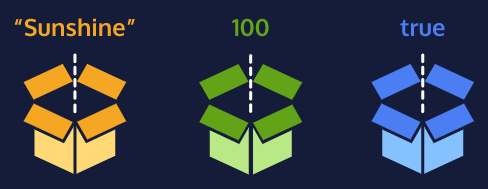

### Create a Variable: var

There were a lot of changes introduced in the ES6 version of JavaScript in 2015. One of the biggest changes was two new keywords, `let` and `const`, to create, or *declare*, variables. Prior to the ES6, programmers could only use the `var` keyword to declare variables.

```javascript
var myName = 'Arya';
console.log(myName);
// Output: Arya
```

Let’s consider the example above:

1. `var`, short for variable, is a JavaScript *keyword* that creates, or *declares*, a new variable.
2. `myName` is the variable’s name. Capitalizing in this way is a standard convention in JavaScript called *camel casing*. In camel casing you group words into one, the first word is lowercase, then every word that follows will have its first letter uppercased. (e.g. camelCaseEverything).
3. `=` is the *assignment operator*. It assigns the value (`'Arya'`) to the variable (`myName`).
4. `'Arya'` is the *value* assigned (`=`) to the variable `myName`. You can also say that the `myName` variable is *initialized* with a value of `'Arya'`.
5. After the variable is declared, the string value `'Arya'` is printed to the console by referencing the variable name: `console.log(myName)`.

There are a few general rules for naming variables:

- Variable names cannot start with numbers.
- Variable names are case sensitive, so `myName` and `myname` would be different variables. It is bad practice to create two variables that have the same name using different cases.
- Variable names cannot be the same as *keywords*. For a comprehensive list of keywords check out [MDN’s keyword documentation](https://developer.mozilla.org/en-US/docs/Web/JavaScript/Reference/Lexical_grammar#Keywords).

> Note: In the next exercises, we will learn why ES6’s `let` and `const` are the preferred variable keywords by many programmers. Because there is still a ton of code written prior to ES6, it’s helpful to be familiar with the pre-ES6 `var` keyword.

### Create a Variable: let

The `let` keyword signals that the variable can be reassigned a different value. Take a look at the example:

```javascript
let meal = 'Enchiladas';
console.log(meal); // Output: Enchiladas
meal = 'Burrito';
console.log(meal); // Output: Burrito
```

Another concept that we should be aware of when using `let` (and even `var`) is that we can declare a variable without assigning the variable a value. In such a case, the variable will be automatically initialized with a value of `undefined`:

```javascript
let price;
console.log(price); // Output: undefined
price = 350;
console.log(price); // Output: 350
```

Notice in the example above:

- If we don’t assign a value to a variable declared using the `let` keyword, it automatically has a value of `undefined`.
- We can reassign the value of the variable.

### Create a Variable: const

The `const` keyword was also introduced in ES6, and is short for the word constant. Just like with `var` and `let` you can store any value in a `const` variable. The way you declare a `const` variable and assign a value to it follows the same structure as `let` and `var`. Take a look at the following example:

```javascript
const myName = 'Gilberto';
console.log(myName); // Output: Gilberto
```

However, a `const` variable cannot be reassigned because it is *constant*. If you try to reassign a `const` variable, you’ll get a `TypeError`.

Constant variables *must* be assigned a value when declared. If you try to declare a `const` variable without a value, you’ll get a `SyntaxError`.

If you’re trying to decide between which keyword to use, `let` or `const`, think about whether you’ll need to reassign the variable later on. If you do need to reassign the variable use `let`, otherwise, use `const`.

### Mathematical Assignment Operators

Let’s consider how we can use variables and math operators to calculate new values and assign them to a variable. Check out the example below:

```javascript
let w = 4;
w = w + 1;
 
console.log(w); // Output: 5
```

Another way we could have reassigned `w` after performing some mathematical operation on it is to use built-in *mathematical assignment operators*. We could re-write the code above to be:

```javascript
let w = 4;
w += 1;
 
console.log(w); // Output: 5
```

In the second example, we used the `+=` assignment operator to reassign `w`. We’re performing the mathematical operation of the first operator `+` using the number to the right, then reassigning `w` to the computed value.

We also have access to other mathematical assignment operators: `-=`, `*=`, and `/=` which work in a similar fashion.

```javascript
let x = 20;
x -= 5; // Can be written as x = x - 5
console.log(x); // Output: 15
 
let y = 50;
y *= 2; // Can be written as y = y * 2
console.log(y); // Output: 100
 
let z = 8;
z /= 2; // Can be written as z = z / 2
console.log(z); // Output: 4
```

### The Increment and Decrement Operator

Other mathematical assignment operators include the *increment operator* (`++`) and *decrement operator* (`--`).

The increment operator will increase the value of the variable by 1. The decrement operator will decrease the value of the variable by 1. For example:

```javascript
let a = 10;
a++;
console.log(a); // Output: 11

let b = 20;
b--;
console.log(b); // Output: 19
```

### String Concatenation with Variables

In previous exercises, we assigned strings to variables. Now, let’s go over how to connect, or concatenate, strings in variables.

The `+` operator can be used to combine two string values even if those values are being stored in variables:

```javascript
let myPet = 'armadillo';
console.log('I own a pet ' + myPet + '.'); 
// Output: 'I own a pet armadillo.'
```

### String Interpolation

In the ES6 version of JavaScript, we can insert, or *interpolate*, variables into strings using *template literals*. Check out the following example where a template literal is used to log strings together:

```javascript
const myPet = 'armadillo';
console.log(`I own a pet ${myPet}.`);
// Output: I own a pet armadillo.
```

Notice that:

- a template literal is wrapped by backticks `
- Inside the template literal, you’ll see a placeholder, `${myPet}`. The value of `myPet` is inserted into the template literal.
- When we interpolate ``I own a pet ${myPet}.``, the output we print is the string: `'I own a pet armadillo.'`

One of the biggest benefits to using template literals is the readability of the code. Using template literals, you can more easily tell what the new string will be. You also don’t have to worry about escaping double quotes or single quotes.

### typeof operator

While writing code, it can be useful to keep track of the data types of the variables in your program. If you need to check the data type of a variable’s value, you can use the `typeof` operator.

The `typeof` operator checks the value to its right and *returns*, or passes back, a string of the data type.

```javascript
const unknown1 = 'foo';
console.log(typeof unknown1); // Output: string
 
const unknown2 = 10;
console.log(typeof unknown2); // Output: number
 
const unknown3 = true; 
console.log(typeof unknown3); // Output: boolean
```

<h2> <a name = "conditional-statements"></a>CONDITIONAL STATEMENTS</h2>

In life, we make decisions based on circumstances. Think of an everyday decision as mundane as falling asleep — if we are tired, we go to bed, otherwise, we wake up and start our day.

These if-else decisions can be modeled in code by creating *conditional statements*. A conditional statement checks a specific condition(s) and performs a task based on the condition(s).

### If Statement

We often perform a task based on a condition. For example, if the weather is nice today, then we will go outside. If the alarm clock rings, then we’ll shut it off. If we’re tired, then we’ll go to sleep.

In programming, we can also perform a task based on a condition using an `if` statement:

```javascript
if (true) {
  console.log('This message will print!'); 
}
// Prints: This message will print!
```

Notice in the example above, we have an `if` statement. The `if` statement is composed of:

- The `if` keyword followed by a set of parentheses `()` which is followed by a *code block*, or *block statement*, indicated by a set of curly braces `{}`.
- Inside the parentheses `()`, a condition is provided that evaluates to `true` or `false`.
- If the condition evaluates to `true`, the code inside the curly braces `{}` runs, or *executes*.
- If the condition evaluates to `false`, the block won’t execute.

### If...Else Statements

If we wanted to add some default behavior to the `if` statement, we can add an `else` statement to run a block of code when the condition evaluates to `false`. Take a look at the inclusion of an `else` statement:

``` javascript
if (false) {
  console.log('The code in this block will not run.');
} else {
  console.log('But the code in this block will!');
}
 
// Prints: But the code in this block will!
```

An `else` statement must be paired with an `if` statement, and together they are referred to as an `if...else` statement.

In the example above, the `else` statement:

- Uses the `else` keyword following the code block of an `if` statement.
- Has a code block that is wrapped by a set of curly braces `{}`.
- The code inside the `else` statement code block will execute when the `if` statement’s condition evaluates to `false`.

`if...else` statements allow us to automate solutions to yes-or-no questions, also known as *binary decisions*.

### Comparison Operators

When writing conditional statements, sometimes we need to use different types of operators to compare values. These operators are called *comparison operators*.

Here is a list of some handy comparison operators and their syntax:

- Less than: `<`
- Greater than: `>`
- Less than or equal to: `<=`
- Greater than or equal to: `>=`
- Is equal to: `===`
- Is not equal to: `!==`

Comparison operators compare the value on the left with the value on the right. For instance:

```javascript
10 < 12 // Evaluates to true
```

It can be helpful to think of comparison statements as questions. When the answer is “yes”, the statement evaluates to `true`, and when the answer is “no”, the statement evaluates to `false`. The code above would be asking: is 10 less than 12? Yes! So `10 < 12` evaluates to `true`.

We can also use comparison operators on different data types like strings:

```javascript
'apples' === 'oranges' // false
```

In the example above, we’re using the *identity operator* (`===`) to check if the string `'apples'` is the same as the string `'oranges'`. Since the two strings are not the same, the comparison statement evaluates to `false`.

All comparison statements evaluate to either `true` or `false` and are made up of:

- Two values that will be compared.
- An operator that separates the values and compares them accordingly (`>`, `<`, `<=`,`>=`,`===`,`!==`).

### Logical Operators

Working with conditionals means that we will be using booleans, `true` or `false` values. In JavaScript, there are operators that work with boolean values known as *logical operators*. We can use logical operators to add more sophisticated logic to our conditionals. There are three logical operators:

- the *and* operator (`&&`)
- the *or* operator (`||`)
- the *not* operator, otherwise known as the *bang* operator (`!`)

When we use the `&&` operator, we are checking that two things are `true`:

```javascript
if (stopLight === 'green' && pedestrians === 0) {
  console.log('Go!');
} else {
  console.log('Stop');
}
```

When using the `&&` operator, both conditions *must* evaluate to `true` for the entire condition to evaluate to `true` and execute. Otherwise, if either condition is `false`, the `&&` condition will evaluate to `false` and the `else` block will execute.

If we only care about either condition being `true`, we can use the `||` operator:

```javascript
if (day === 'Saturday' || day === 'Sunday') {
  console.log('Enjoy the weekend!');
} else {
  console.log('Do some work.');
}
```

When using the `||` operator, only one of the conditions must evaluate to `true` for the overall statement to evaluate to `true`. In the code example above, if either `day === 'Saturday'` or `day === 'Sunday'` evaluates to `true` the `if`‘s condition will evaluate to `true` and its code block will execute. If the first condition in an `||` statement evaluates to `true`, the second condition won’t even be checked. Only if `day === 'Saturday'` evaluates to `false` will `day === 'Sunday'` be evaluated. The code in the `else` statement above will execute only if both comparisons evaluate to `false`.

The `!` *not operator* reverses, or *negates*, the value of a boolean:

```javascript
let excited = true;
console.log(!excited); // Prints false
 
let sleepy = false;
console.log(!sleepy); // Prints true
```

Essentially, the `!` operator will either take a `true` value and pass back `false`, or it will take a `false` value and pass back `true`.

Logical operators are often used in conditional statements to add another layer of logic to our code.

### Truthy and Falsy

Let’s consider how non-boolean data types, like strings or numbers, are evaluated when checked inside a condition.

Sometimes, you’ll want to check if a variable exists and you won’t necessarily want it to equal a specific value — you’ll only check to see if the variable has been assigned a value.

Here’s an example:

```javascript
let myVariable = 'I Exist!';
 
if (myVariable) {
   console.log(myVariable)
} else {
   console.log('The variable does not exist.')
}
```

The code block in the `if` statement will run because `myVariable` has a *truthy* value; even though the value of `myVariable` is not explicitly the value `true`, when used in a boolean or conditional context, it evaluates to `true` because it has been assigned a non-falsy value.

So which values are *falsy*— or evaluate to `false` when checked as a condition? The list of falsy values includes:

- `0`
- Empty strings like `""` or `''`
- `null` which represent when there is no value at all
- `undefined` which represent when a declared variable lacks a value
- `NaN`, or Not a Number

Here’s an example with numbers:

```javascript
let numberOfApples = 0;
 
if (numberOfApples){
   console.log('Let us eat apples!');
} else {
   console.log('No apples left!');
}
 
// Prints 'No apples left!'
```

The condition evaluates to `false` because the value of the `numberOfApples` is `0`. Since `0` is a falsy value, the code block in the `else` statement will run.

### Truthy and Falsy Assignment

Truthy and falsy evaluations open a world of short-hand possibilities!

Say you have a website and want to take a user’s username to make a personalized greeting. Sometimes, the user does not have an account, making the `username` variable falsy. The code below checks if `username` is defined and assigns a default string if it is not:

```javascript
let defaultName;
if (username) {
  defaultName = username;
} else {
  defaultName = 'Stranger';
}
```

If you combine your knowledge of logical operators you can use a short-hand for the code above. In a boolean condition, JavaScript assigns the truthy value to a variable if you use the `||` operator in your assignment:

```javascript
let defaultName = username || 'Stranger';
```

Because `||` or statements check the left-hand condition first, the variable `defaultName` will be assigned the actual value of `username` if it is truthy, and it will be assigned the value of `'Stranger'` if `username` is falsy. This concept is also referred to as *short-circuit evaluation*.

### Ternary Operator

In the spirit of using short-hand syntax, we can use a *ternary operator* to simplify an `if...else` statement.

Take a look at the `if...else` statement example:

```javascript
let isNightTime = true;
 
if (isNightTime) {
  console.log('Turn on the lights!');
} else {
  console.log('Turn off the lights!');
}
```

We can use a *ternary operator* to perform the same functionality:

```javascript
isNightTime ? console.log('Turn on the lights!') : console.log('Turn off the lights!');
```

In the example above:

- The condition, `isNightTime`, is provided before the `?`.
- Two expressions follow the `?` and are separated by a colon `:`.
- If the condition evaluates to `true`, the first expression executes.
- If the condition evaluates to `false`, the second expression executes.

Like `if...else` statements, ternary operators can be used for conditions which evaluate to `true` or `false`.

### Else If Statements

We can add more conditions to our `if...else` with an `else if` statement. The `else if` statement allows for more than two possible outcomes. You can add as many `else if` statements as you’d like, to make more complex conditionals!

The `else if` statement always comes after the `if` statement and before the `else` statement. The `else if` statement also takes a condition. Let’s take a look at the syntax:

```javascript
let stopLight = 'yellow';
 
if (stopLight === 'red') {
  console.log('Stop!');
} else if (stopLight === 'yellow') {
  console.log('Slow down.');
} else if (stopLight === 'green') {
  console.log('Go!');
} else {
  console.log('Caution, unknown!');
}
```

The `else if` statements allow you to have multiple possible outcomes. `if`/`else if`/`else` statements are read from top to bottom, so the first condition that evaluates to `true` from the top to bottom is the block that gets executed.

In the example above, since `stopLight === 'red'` evaluates to `false` and `stopLight === 'yellow'` evaluates to `true`, the code inside the first `else if` statement is executed. The rest of the conditions are not evaluated. If none of the conditions evaluated to `true`, then the code in the `else` statement would have executed.

### The switch keyword

`else if` statements are a great tool if we need to check multiple conditions. In programming, we often find ourselves needing to check multiple values and handling each of them differently. For example:

```javascript
let groceryItem = 'papaya';
 
if (groceryItem === 'tomato') {
  console.log('Tomatoes are $0.49');
} else if (groceryItem === 'papaya'){
  console.log('Papayas are $1.29');
} else {
  console.log('Invalid item');
}
```

In the code above, we have a series of conditions checking for a value that matches a `groceryItem` variable. Our code works fine, but imagine if we needed to check 100 different values! Having to write that many `else if` statements sounds like a pain!

A `switch` statement provides an alternative syntax that is easier to read and write. A `switch` statement looks like this:

```javascript
let groceryItem = 'papaya';
 
switch (groceryItem) {
  case 'tomato':
    console.log('Tomatoes are $0.49');
    break;
  case 'lime':
    console.log('Limes are $1.49');
    break;
  case 'papaya':
    console.log('Papayas are $1.29');
    break;
  default:
    console.log('Invalid item');
    break;
}
 
// Prints 'Papayas are $1.29'
```

- The `switch` keyword initiates the statement and is followed by `( ... )`, which contains the value that each `case` will compare. In the example, the value or expression of the `switch` statement is `groceryItem`.
- Inside the block, `{ ... }`, there are multiple `case`s. The `case` keyword checks if the expression matches the specified value that comes after it. The value following the first `case` is `'tomato'`. If the value of `groceryItem` equalled `'tomato'`, that `case`‘s `console.log()` would run.
- The value of `groceryItem` is `'papaya'`, so the third `case` runs— `Papayas are $1.29` is logged to the console.
- The `break` keyword tells the computer to exit the block and not execute any more code or check any other cases inside the code block. Note: Without `break` keywords, the first matching case will run, but so will every subsequent case regardless of whether or not it matches—including the default. This behavior is different from `if`/`else` conditional statements that execute only one block of code.
- At the end of each `switch` statement, there is a `default` statement. If none of the `case`s are true, then the code in the `default` statement will run.

<h2> <a name = "functions"></a>FUNCTIONS</h2>

In programming, we often use code to perform a specific task multiple times. Instead of rewriting the same code, we can group a block of code together and associate it with one task, then we can reuse that block of code whenever we need to perform the task again. We achieve this by creating a *function*. A function is a reusable block of code that groups together a sequence of statements to perform a specific task.

### Function Declarations

In JavaScript, there are many ways to create a function. One way to create a function is by using a *function declaration*. Just like how a variable declaration binds a value to a variable name, a function declaration binds a function to a name, or an *identifier*. Take a look at the anatomy of a function declaration below:

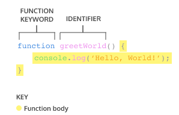

A function declaration consists of:

- The `function` keyword.
- The name of the function, or its identifier, followed by parentheses.
- A function body, or the block of statements required to perform a specific task, enclosed in the function’s curly brackets, `{ }`.

A function declaration is a function that is bound to an identifier, or name.

**We should also be aware of the *hoisting* feature in JavaScript which allows access to function declarations before they’re defined.**

Take a look at example of **hoisting**:

```javascript
greetWorld(); // Output: Hello, World!
 
function greetWorld() {
  console.log('Hello, World!');
}
```

Notice how hoisting allowed `greetWorld()` to be called before the `greetWorld()` function was defined! Since hoisting isn’t considered good practice, we simply want you to be aware of this feature.

> If you want to read more about hoisting, check out [MDN documentation on hoisting](https://developer.mozilla.org/en-US/docs/Glossary/Hoisting).

### Calling a Function

As we saw in previous exercises, a function declaration binds a function to an identifier.

However, a function declaration does not ask the code inside the function body to run, it just declares the existence of the function. The code inside a function body runs, or *executes*, only when the function is *called*.

To call a function in your code, you type the function name followed by parentheses.

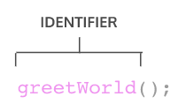

This *function call* executes the function body, or all of the statements between the curly braces in the function declaration.

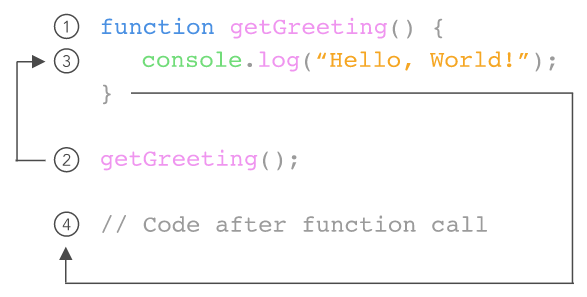

We can call the same function as many times as needed.

### Parameters and Arguments

So far, the functions we’ve created execute a task without an input. However, some functions can take inputs and use the inputs to perform a task. When declaring a function, we can specify its *parameters*. Parameters allow functions to accept input(s) and perform a task using the input(s). We use parameters as placeholders for information that will be passed to the function when it is called.

Let’s observe how to specify parameters in our function declaration:

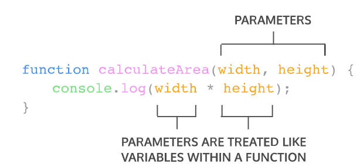

In the diagram above, `calculateArea()`, computes the area of a rectangle, based on two inputs, `width` and `height`. The parameters are specified between the parenthesis as `width` and `height`, and inside the function body, they act just like regular variables. `width` and `height` act as placeholders for values that will be multiplied together.

When calling a function that has parameters, we specify the values in the parentheses that follow the function name. The values that are passed to the function when it is called are called *arguments*. Arguments can be passed to the function as values or variables.

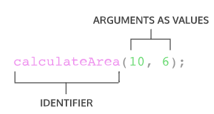

In the function call above, the number `10` is passed as the `width` and `6` is passed as `height`. Notice that the order in which arguments are passed and assigned follows the order that the parameters are declared.

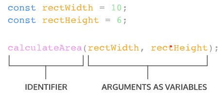

The variables `rectWidth` and `rectHeight` are initialized with the values for the height and width of a rectangle before being used in the function call.

By using parameters, `calculateArea()` can be reused to compute the area of any rectangle!

### Default Parameters

One of the features added in ES6 is the ability to use *default parameters*. Default parameters allow parameters to have a predetermined value in case there is no argument passed into the function or if the argument is `undefined` when called.

Take a look at the code snippet below that uses a default parameter:

```javascript
function greeting (name = 'stranger') {
  console.log(`Hello, ${name}!`)
}
 
greeting('Nick') // Output: Hello, Nick!
greeting() // Output: Hello, stranger!
```

- In the example above, we used the `=` operator to assign the parameter `name` a default value of `'stranger'`. This is useful to have in case we ever want to include a non-personalized default greeting!
- When the code calls `greeting('Nick')` the value of the argument is passed in and, `'Nick'`, will override the default parameter of `'stranger'` to log `'Hello, Nick!'` to the console.
- When there isn’t an argument passed into `greeting()`, the default value of `'stranger'` is used, and `'Hello, stranger!'` is logged to the console.

By using a default parameter, we account for situations when an argument isn’t passed into a function that is expecting an argument.

### Return

When a function is called, the computer will run through the function’s code and evaluate the result of calling the function. By default that resulting value is `undefined`.

```javascript
function rectangleArea(width, height) {
  let area = width * height;
}
console.log(rectangleArea(5, 7)) // Prints undefined
```

In the code example, we defined our function to calculate the `area` of a `width` and `height` parameter. Then `rectangleArea()` is invoked with the arguments `5` and `7`. But when we went to print the results we got `undefined`. Did we write our function wrong? No! In fact, the function worked fine, and the computer did calculate the area as `35`, but we didn’t capture it. So how can we do that? With the keyword `return`!

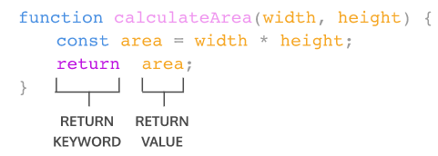

To pass back information from the function call, we use a return statement. To create a return statement, we use the `return` keyword followed by the value that we wish to return. Like we saw above, if the value is omitted, `undefined` is returned instead.

When a `return` statement is used in a function body, the execution of the function is stopped and the code that follows it will not be executed. Look at the example below:

```javascript
function rectangleArea(width, height) {
  if (width < 0 || height < 0) {
    return 'You need positive integers to calculate area!';
  }
  return width * height;
}
```

If an argument for `width` or `height` is less than `0`, then `rectangleArea()` will return `'You need positive integers to calculate area!'`. The second return statement `width * height` will not run.

The `return` keyword is powerful because it allows functions to produce an output. We can then save the output to a variable for later use.

### Helper Functions

We can also use the return value of a function inside another function. These functions being called within another function are often referred to as *helper functions*. Since each function is carrying out a specific task, it makes our code easier to read and debug if necessary.

If we wanted to define a function that converts the temperature from Celsius to Fahrenheit, we could write two functions like:

```javascript
function multiplyByNineFifths(number) {
  return number * (9/5);
};
 
function getFahrenheit(celsius) {
  return multiplyByNineFifths(celsius) + 32;
};
 
getFahrenheit(15); // Returns 59
```

In the example above:

- `getFahrenheit()` is called and `15` is passed as an argument.
- The code block inside of `getFahrenheit()` calls `multiplyByNineFifths()` and passes `15` as an argument.
- `multiplyByNineFifths()` takes the argument of `15` for the `number` parameter.
- The code block inside of `multiplyByNineFifths()` function multiplies `15` by `(9/5)`, which evaluates to `27`.
- `27` is returned back to the function call in `getFahrenheit()`.
- `getFahrenheit()` continues to execute. It adds `32` to `27`, which evaluates to `59`.
- Finally, `59` is returned back to the function call `getFahrenheit(15)`.

We can use functions to section off small bits of logic or tasks, then use them when we need to. Writing helper functions can help take large and difficult tasks and break them into smaller and more manageable tasks.

### Function Expressions

Another way to define a function is to use a *function expression*. To define a function inside an expression, we can use the `function` keyword. In a function expression, the function name is usually omitted. A function with no name is called an *anonymous function*. A function expression is often stored in a variable in order to refer to it.

Consider the following function expression:

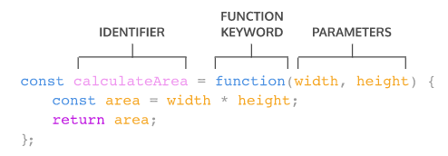

To declare a function expression:

1. Declare a variable to make the variable’s name be the name, or identifier, of your function. Since the release of ES6, it is common practice to use `const` as the keyword to declare the variable.
2. Assign as that variable’s value an anonymous function created by using the `function` keyword followed by a set of parentheses with possible parameters. Then a set of curly braces that contain the function body.

To invoke a function expression, write the name of the variable in which the function is stored followed by parentheses enclosing any arguments being passed into the function.

```javascript
variableName(argument1, argument2)
```

> Unlike function declarations, function expressions are not hoisted so they cannot be called before they are defined.

### Arrow Functions

ES6 introduced *arrow function syntax*, a shorter way to write functions by using the special “fat arrow” `() =>` notation.

Arrow functions remove the need to type out the keyword `function` every time you need to create a function. Instead, you first include the parameters inside the `( )` and then add an arrow `=>` that points to the function body surrounded in `{ }` like this:

```javascript
const rectangleArea = (width, height) => {
  let area = width * height;
  return area;
};
```

### Concise Body Arrow Functions

JavaScript also provides several ways to refactor arrow function syntax. The most condensed form of the function is known as *concise body*. We’ll explore a few of these techniques below:

1. Functions that take only a single parameter do not need that parameter to be enclosed in parentheses. However, if a function takes zero or multiple parameters, parentheses are required.

   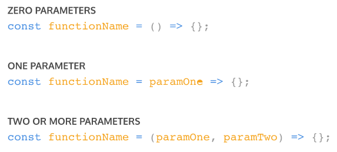

2. A function body composed of a single-line block does not need curly braces. Without the curly braces, whatever that line evaluates will be automatically returned. The contents of the block should immediately follow the arrow `=>` and the `return` keyword can be removed. This is referred to as *implicit return*.

   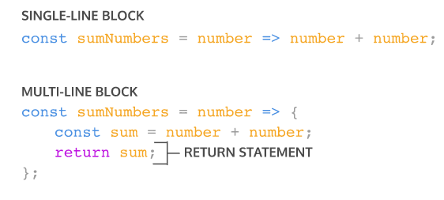

So if we have a function:

```javascript
const squareNum = (num) => {
  return num * num;
};
```

We can refactor the function to:

```javascript
const squareNum = num => num * num;
```

Notice the following changes:

- The parentheses around `num` have been removed, since it has a single parameter.
- The curly braces `{ }` have been removed since the function consists of a single-line block.
- The `return` keyword has been removed since the function consists of a single-line block.

<h2> <a name = "scope"></a>SCOPE</h2>

An important idea in programming is *scope*. Scope defines where variables can be accessed or referenced. While some variables can be accessed from anywhere within a program, other variables may only be available in a specific context.

You can think of scope like the view of the night sky from your window. Everyone who lives on the planet Earth is in the global scope of the stars. The stars are accessible *globally*. Meanwhile, if you live in a city, you may see the city skyline or the river. The skyline and river are only accessible *locally* in your city, but you can still see the stars that are available globally.

### Blocks and Scope

Before we talk more about scope, we first need to talk about *blocks*.

We’ve seen blocks used before in functions and `if` statements. A block is the code found inside a set of curly braces `{}`. Blocks help us group one or more statements together and serve as an important structural marker for our code.

A block of code could be a function, like this:

```javascript
const logSkyColor = () => {
  let color = 'blue'; 
  console.log(color); // blue 
}
```

Notice that the function body is actually a block of code.

Observe the block in an `if` statement:

```javascript
if (dusk) {
  let color = 'pink';
  console.log(color); // pink
}
```

### Global Scope

Scope is the context in which our variables are declared. We think about scope in relation to blocks because variables can exist either outside of or within these blocks.

In *global scope*, variables are declared outside of blocks. These variables are called *global variables*. Because global variables are not bound inside a block, they can be accessed by any code in the program, including code in blocks.

Let’s take a look at an example of global scope:

```javascript
const color = 'blue';
 
const returnSkyColor = () => {
  return color; // blue 
};
 
console.log(returnSkyColor()); // blue
```

- Even though the `color` variable is defined outside of the block, it can be accessed in the function block, giving it global scope.
- In turn, `color` can be accessed within the `returnSkyColor` function block.

### Block Scope

The next context we’ll cover is *block scope*. When a variable is defined inside a block, it is only accessible to the code within the curly braces `{}`. We say that variable has *block scope* because it is *only* accessible to the lines of code within that block.

Variables that are declared with block scope are known as *local variables* because they are only available to the code that is part of the same block.

Block scope works like this:

```javascript
const logSkyColor = () => {
  let color = 'blue'; 
  console.log(color); // blue 
};
 
logSkyColor(); // blue 
console.log(color); // ReferenceError
```

You’ll notice:

- We define a function `logSkyColor()`.
- Within the function, the `color` variable is only available within the curly braces of the function.
- If we try to log the same variable outside the function, throws a `ReferenceError`.

### Scope Pollution

It may seem like a great idea to always make your variables accessible, but having too many global variables can cause problems in a program.

When you declare global variables, they go to the *global namespace*. The global namespace allows the variables to be accessible from anywhere in the program. These variables remain there until the program finishes which means our global namespace can fill up really quickly.

*Scope pollution* is when we have too many global variables that exist in the global namespace, or when we reuse variables across different scopes. Scope pollution makes it difficult to keep track of our different variables and sets us up for potential accidents. For example, globally scoped variables can collide with other variables that are more locally scoped, causing unexpected behavior in our code.

Let’s look at an example of scope pollution in practice so we know how to avoid it:

```javascript
let num = 50;
 
const logNum = () => {
  num = 100; // Take note of this line of code
  console.log(num);
};
 
logNum(); // Prints 100
console.log(num); // Prints 100
```

You’ll notice:

- We have a variable `num`.
- Inside the function body of `logNum()`, we want to declare a new variable but forgot to use the `let` keyword.
- When we call `logNum()`, `num` gets reassigned to `100`.
- The reassignment inside `logNum()` affects the global variable `num`.
- Even though the reassignment is allowed and we won’t get an error, if we decided to use `num` later, we’ll unknowingly use the new value of `num`.

While it’s important to know what global scope is, it’s best practice to not define variables in the global scope.

### Practice Good Scoping

Given the challenges with global variables and scope pollution, we should follow best practices for scoping our variables as tightly as possible using block scope.

Tightly scoping your variables will greatly improve your code in several ways:

- It will make your code more legible since the blocks will organize your code into discrete sections.
- It makes your code more understandable since it clarifies which variables are associated with different parts of the program rather than having to keep track of them line after line!
- It’s easier to maintain your code, since your code will be modular.
- It will save memory in your code because it will cease to exist after the block finishes running.

Here’s another example of how to use block scope, as defined within an `if` block:

```javascript
const logSkyColor = () => {
  const dusk = true;
  let color = 'blue'; 
  if (dusk) {
    let color = 'pink';
    console.log(color); // pink
  }
  console.log(color); // blue 
};
 
console.log(color); // ReferenceError
```

Here, you’ll notice:

- We create a variable `dusk` inside the `logSkyColor()` function.
- After the `if` statement, we define a new code block with the `{}` braces. Here we assign a new value to the variable `color` if the `if` statement is truthy.
- Within the `if` block, the `color` variable holds the value `'pink'`, though outside the `if` block, in the function body, the `color` variable holds the value `'blue'`.
- While we use block scope, we still pollute our namespace by reusing the same variable name twice. A better practice would be to rename the variable inside the block.

Block scope is a powerful tool in JavaScript, since it allows us to define variables with precision, and not pollute the global namespace. If a variable does not need to exist outside a block— it shouldn’t!

<h2> <a name = "arrays"></a>ARRAYS</h2>

Organizing and storing data is a foundational concept of programming.

One way we organize data in real life is by making lists. Let’s make one here:

```
New Year's Resolutions:

1. Keep a journal 
2. Take a falconry class
3. Learn to juggle
```

Let’s now write this list in JavaScript, as an *array*:

```javascript
let newYearsResolutions = ['Keep a journal', 'Take a falconry class', 'Learn to juggle'];
```

Arrays are JavaScript’s way of making lists. Arrays can store any data types (including strings, numbers, and booleans). Like lists, arrays are ordered, meaning each item has a numbered position.

### Create an Array

One way we can create an array is to use an *array literal*. An array literal creates an array by wrapping items in square brackets `[]`. Remember from the previous exercise, arrays can store any data type — we can have an array that holds all the same data types or an array that holds different data types.

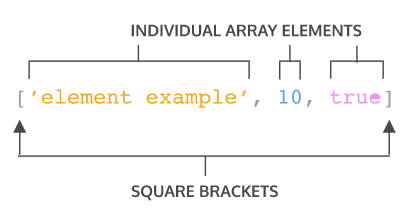

Let’s take a closer look at the syntax in the array example:

- The array is represented by the square brackets `[]` and the content inside.
- Each content item inside an array is called an *element*.
- There are three different elements inside the array.
- Each element inside the array is a different data type.

We can also save an array to a variable. You may have noticed we did this in the previous exercise:

```javascript
let newYearsResolutions = ['Keep a journal', 'Take a falconry class', 'Learn to juggle'];
```

### Accessing Elements

Each element in an array has a numbered position known as its *index*. We can access individual items using their index, which is similar to referencing an item in a list based on the item’s position.

Arrays in JavaScript are *zero-indexed*, meaning the positions start counting from `0` rather than `1`. Therefore, the first item in an array will be at position `0`. Let’s see how we could access an element in an array:

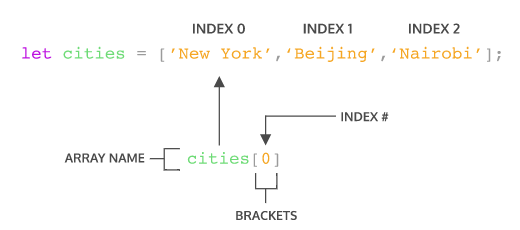

In the code snippet above:

- `cities` is an array that has three elements.
- We’re using bracket notation, `[]` with the index after the name of the array to access the element.
- `cities[0]` will access the element at index `0` in the array `cities`. You can think of `cities[0]` as accessing the space in memory that holds the string `'New York'`.

You can also access individual characters in a string using bracket notation and the index. For instance, you can write:

```javascript
const hello = 'Hello World';
console.log(hello[6]);
// Output: W
```

### Update Elements

In the previous exercise, you learned how to access elements inside an array or a string by using an index. Once you have access to an element in an array, you can update its value.

```javascript
let seasons = ['Winter', 'Spring', 'Summer', 'Fall'];
 
seasons[3] = 'Autumn';
console.log(seasons); 
//Output: ['Winter', 'Spring', 'Summer', 'Autumn']
```

In the example above, the `seasons` array contained the names of the four seasons.

However, we decided that we preferred to say `'Autumn'` instead of `'Fall'`.

The line, `seasons[3] = 'Autumn';` tells our program to change the item at index 3 of the `seasons` array to be `'Autumn'` instead of what is already there.

### Arrays with let and const

You may recall that you can declare variables with both the `let` and `const` keywords. Variables declared with `let` can be reassigned.

Variables declared with the `const` keyword cannot be reassigned. However, elements in an array declared with `const` remain mutable. Meaning that we can change the contents of a `const` array, but cannot reassign a new array or a different value.

### The .length property

One of an array’s built-in properties is `length` and it returns the number of items in the array. We access the `.length` property just like we do with strings. Check the example below:

```javascript
const newYearsResolutions = ['Keep a journal', 'Take a falconry class'];
 
console.log(newYearsResolutions.length);
// Output: 2
```

In the example above, we log `newYearsResolutions.length` to the console using the following steps:

- We use *dot notation*, chaining a period with the property name to the array, to access the `length` property of the `newYearsResolutions` array.
- Then we log the `length` of `newYearsResolution` to the console.
- Since `newYearsResolution` has two elements, so `2` would be logged to the console.

When we want to know how many elements are in an array, we can access the `.length` property

### The .push() Method

Let’s learn about some built-in JavaScript methods that make working with arrays easier. These methods are specifically called on arrays to make common tasks, like adding and removing elements, more straightforward.

One method, `.push()` allows us to add items to the end of an array. Here is an example of how this is used:

```javascript
const itemTracker = ['item 0', 'item 1', 'item 2'];
 
itemTracker.push('item 3', 'item 4');
 
console.log(itemTracker); 
// Output: ['item 0', 'item 1', 'item 2', 'item 3', 'item 4'];
```

So, how does `.push()` work?

- We access the `push` method by using dot notation, connecting `push` to `itemTracker` with a period.
- Then we call it like a function. That’s because `.push()` is a function and one that JavaScript allows us to use right on an array.
- `.push()` can take a single argument or multiple arguments separated by commas. In this case, we’re adding two elements: `'item 3'` and `'item 4'` to `itemTracker`.
- Notice that `.push()` changes, or *mutates*, `itemTracker`. You might also see `.push()` referred to as a *destructive* array method since it changes the initial array.

If you’re looking for a method that will mutate an array by adding elements to it, then `.push()` is the method for you!

### The .pop() Method

Another array method, `.pop()`, removes the last item of an array.

```javascript
const newItemTracker = ['item 0', 'item 1', 'item 2'];
 
const removed = newItemTracker.pop();
 
console.log(newItemTracker); 
// Output: [ 'item 0', 'item 1' ]
console.log(removed);
// Output: item 2
```

- In the example above, calling `.pop()` on the `newItemTracker` array removed `item 2` from the end.
- `.pop()` does not take any arguments, it simply removes the last element of `newItemTracker`.
- `.pop()` returns the value of the last element. In the example, we store the returned value in a variable `removed` to be used for later.
- `.pop()` is a method that mutates the initial array.

When you need to mutate an array by removing the last element, use `.pop()`.

### More Array Methods

There are many more array methods than just `.push()` and `.pop()`. You can read about all of the array methods that exist on the [Mozilla Developer Network (MDN) array documentation](https://developer.mozilla.org/en-US/docs/Web/JavaScript/Reference/Global_Objects/Array).

`.pop()` and `.push()` mutate the array on which they’re called. However, there are times that we don’t want to mutate the original array and we can use non-mutating array methods. Be sure to check MDN to understand the behavior of the method you are using.

Some arrays methods that are available to JavaScript developers include: `.join()`, `.slice()`, `.splice()`, `.shift()`, `.unshift()`, and `.concat()` amongst many others. Using these built-in methods make it easier to do some common tasks when working with arrays.

### Arrays and Functions

Throughout the lesson we went over arrays being mutable, or changeable. Well what happens if we try to change an array inside a function? Does the array keep the change after the function call or is it scoped to inside the function?

Take a look at the following example where we call `.push()` on an array inside a function. Recall, the `.push()` method mutates, or changes, an array:

```javascript
const flowers = ['peony', 'daffodil', 'marigold'];
 
function addFlower(arr) {
  arr.push('lily');
}
 
addFlower(flowers);
 
console.log(flowers); // Output: ['peony', 'daffodil', 'marigold', 'lily']
```

- The `flowers` array that has 3 elements.
- The function `addFlower()` has a parameter of `arr` uses `.push()` to add a `'lily'` element into `arr`.
- We call `addFlower()` with an argument of `flowers` which will execute the code inside `addFlower`.
- We check the value of `flowers` and it now includes the `'lily'` element! The array was mutated!

So when you pass an array into a function, if the array is mutated inside the function, that change will be maintained outside the function as well. You might also see this concept explained as *pass-by-reference* since what we’re actually passing the function is a reference to where the variable memory is stored and changing the memory.

### Nested Arrays

Earlier we mentioned that arrays can store other arrays. When an array contains another array it is known as a *nested array*. Examine the example below:

```javascript
const nestedArr = [[1], [2, 3]];
```

To access the nested arrays we can use bracket notation with the index value, just like we did to access any other element:

```javascript
const nestedArr = [[1], [2, 3]];
 
console.log(nestedArr[1]); // Output: [2, 3]
```

Notice that `nestedArr[1]` will grab the element in index 1 which is the array `[2, 3]`. Then, if we wanted to access the elements within the nested array we can *chain*, or add on, more bracket notation with index values.

```javascript
const nestedArr = [[1], [2, 3]];
 
console.log(nestedArr[1]); // Output: [2, 3]
console.log(nestedArr[1][0]); // Output: 2
```

In the second `console.log()` statement, we have two bracket notations chained to `nestedArr`. We know that `nestedArr[1]` is the array `[2, 3]`. Then to grab the first element from that array, we use `nestedArr[1][0]` and we get the value of `2`.

<h2> <a name = "loops"></a>LOOPS</h2>

A *loop* is a programming tool that repeats a set of instructions until a specified condition, called a *stopping condition* is reached. As a programmer, you’ll find that you rely on loops all the time! You’ll hear the generic term *iterate* when referring to loops; iterate simply means “to repeat”.

When we need to reuse a task in our code, we often bundle that action in a function. Similarly, when we see that a process has to repeat multiple times in a row, we write a loop. Loops allow us to create efficient code that automates processes to make scalable, manageable programs.

As illustrated in the diagram, loops iterate or repeat an action until a specific condition is met. When the condition is met, the loop stops and the computer moves on to the next part of the program.

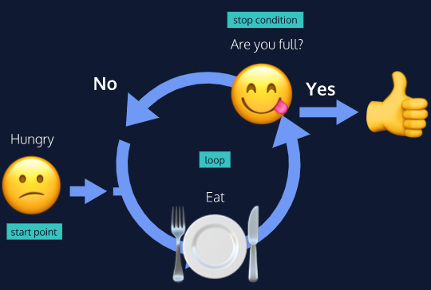

### The For Loop

Instead of writing out the same code over and over, loops allow us to tell computers to repeat a given block of code on its own. One way to give computers these instructions is with a `for` loop.

The typical `for` loop includes an *iterator variable* that usually appears in all three expressions. The iterator variable is initialized, checked against the stopping condition, and assigned a new value on each loop iteration. Iterator variables can have any name, but it’s best practice to use a descriptive variable name.

A `for` loop contains three expressions separated by `;` inside the parentheses:

1. an *initialization* starts the loop and can also be used to declare the iterator variable.
2. a *stopping condition* is the condition that the iterator variable is evaluated against— if the condition evaluates to `true` the code block will run, and if it evaluates to `false` the code will stop.
3. an *iteration statement* is used to update the iterator variable on each loop.

The `for` loop syntax looks like this:

```javascript
for (let counter = 0; counter < 4; counter++) {
  console.log(counter);
}
```

In this example, the output would be the following:

```
0
1
2
3
```

Let’s break down the example:

- The initialization is `let counter = 0`, so the loop will start counting at `0`.
- The stopping condition is `counter < 4`, meaning the loop will run as long as the iterator variable, `counter`, is less than 4.
- The iteration statement is `counter++`. This means after each loop, the value of `counter` will increase by 1. For the first iteration `counter` will equal `0`, for the second iteration `counter` will equal 1, and so on.
- The code block is inside of the curly braces, `console.log(counter)`, will execute until the condition evaluates to `false`. The condition will be false when `counter` is greater than or equal to 4 — the point that the condition becomes false is sometimes called the *stop condition*.

This `for` loop makes it possible to write `0`, `1`, `2`, and `3` programmatically.

### Looping through Arrays

`for` loops are very handy for iterating over data structures. For example, we can use a `for` loop to perform the same operation on each element on an array. Arrays hold lists of data, like customer names or product information. Imagine we owned a store and wanted to increase the price of every product in our catalog. That could be a lot of repeating code, but by using a `for` loop to iterate through the array we could accomplish this task easily.

To loop through each element in an array, a `for` loop should use the array’s `.length` property in its condition.

Check out the example below to see how `for` loops iterate on arrays:

```javascript
const animals = ['Grizzly Bear', 'Sloth', 'Sea Lion'];
for (let i = 0; i < animals.length; i++){
  console.log(animals[i]);
}
```

This example would give you the following output:

```
Grizzly Bear
Sloth
Sea Lion
```

In the loop above, we’ve named our iterator variable `i`. This is a variable naming convention you’ll see in a lot of loops. When we use `i` to iterate through arrays we can think of it as being short-hand for the word **i**ndex. Notice how our stopping condition checks that `i` is less than `animals.length`. Remember that arrays are zero-indexed, the index of the last element of an array is equivalent to the length of that array minus 1. If we tried to access an element at the index of `animals.length` we will have gone too far!

### Nested Loops

When we have a loop running inside another loop, we call that a *nested loop*. One use for a nested `for` loop is to compare the elements in two arrays. For each round of the outer `for` loop, the inner `for` loop will run completely.

Let’s look at an example of a nested `for` loop:

```javascript
const myArray = [6, 19, 20];
const yourArray = [19, 81, 2];
for (let i = 0; i < myArray.length; i++) {
  for (let j = 0; j < yourArray.length; j++) {
    if (myArray[i] === yourArray[j]) {
      console.log('Both loops have the number: ' + yourArray[j])
    }
  }
};
```

Let’s think about what’s happening in the nested loop in our example. For each element in the outer loop array, `myArray`, the inner loop will run in its entirety comparing the current element from the outer array, `myArray[i]`, to each element in the inner array, `yourArray[j]`. When it finds a match, it prints a string to the console.

### The While Loop

```javascript
// A for loop that prints 1, 2, and 3
for (let counterOne = 1; counterOne < 4; counterOne++){
  console.log(counterOne);
}
 
// A while loop that prints 1, 2, and 3
let counterTwo = 1;
while (counterTwo < 4) {
  console.log(counterTwo);
  counterTwo++;
}
```

Let’s break down what’s happening with our `while` loop syntax:

- The `counterTwo` variable is declared before the loop. We can access it inside our `while` loop since it’s in the global scope.
- We start our loop with the keyword `while` followed by our stopping condition, or *test condition*. This will be evaluated before each round of the loop. While the condition evaluates to `true`, the block will continue to run. Once it evaluates to `false` the loop will stop.
- Next, we have our loop’s code block which prints `counterTwo` to the console and increments `counterTwo`.

What would happen if we didn’t increment `counterTwo` inside our block? If we didn’t include this, `counterTwo` would always have its initial value, `1`. That would mean the testing condition `counterTwo < 4` would always evaluate to `true` and our loop would never stop running! Remember, this is called an *infinite loop* and it’s something we always want to **avoid**. Infinite loops can take up all of your computer’s processing power potentially freezing your computer.

So you may be wondering when to use a `while` loop! The syntax of a `for` loop is ideal when we know how many times the loop should run, but we don’t always know this in advance. Think of eating like a `while` loop: when you start taking bites, you don’t know the exact number you’ll need to become full. Rather you’ll eat `while` you’re hungry. **In situations when we want a loop to execute an undetermined number of times, `while` loops are the best choice.**

### Do...While Statements

In some cases, you want a piece of code to run at least once and then loop based on a specific condition after its initial run. This is where the `do...while` statement comes in.

A `do...while` statement says to do a task once and then keep doing it until a specified condition is no longer met. The syntax for a `do...while` statement looks like this:

```javascript
let countString = '';
let i = 0;
 
do {
  countString = countString + i;
  i++;
} while (i < 5);
 
console.log(countString);
```

In this example, the code block makes changes to the `countString` variable by appending the string form of the `i` variable to it. First, the code block after the `do` keyword is executed once. Then the condition is evaluated. If the condition evaluates to `true`, the block will execute again. The looping stops when the condition evaluates to `false`.

Note that the `while` and `do...while` loop are different! Unlike the `while` loop, `do...while` will run at least once whether or not the condition evaluates to `true`.

```javascript
const firstMessage = 'I will print!';
const secondMessage = 'I will not print!'; 
 
// A do while with a stopping condition that evaluates to false
do {
 console.log(firstMessage)
} while (true === false);
 
// A while loop with a stopping condition that evaluates to false
while (true === false){
  console.log(secondMessage)
};
```

### The break Keyword

Imagine we’re looking to adopt a dog. We plan to go to the shelter every day for a year and then give up. But what if we meet our dream dog on day 65? We don’t want to keep going to the shelter for the next 300 days just because our original plan was to go for a whole year. In our code, when we want to stop a loop from continuing to execute even though the original stopping condition we wrote for our loop hasn’t been met, we can use the keyword `break`.

The `break` keyword allows programs to “break” out of the loop from within the loop’s block.

Let’s check out the syntax of a `break` keyword:

```javascript
for (let i = 0; i < 99; i++) {
  if (i > 2 ) {
     break;
  }
  console.log('Banana.');
}
 
console.log('Orange you glad I broke out the loop!');
```

This is the output for the above code:

```
Banana.
Banana.
Banana.
Orange you glad I broke out the loop!
```

`break` statements can be especially helpful when we’re looping through large data structures! With breaks, we can add test conditions besides the stopping condition, and exit the loop when they’re met.

<h2> <a name = "higher-order-functions"></a>HIGHER-ORDER FUNCTIONS</h2>

We are often unaware of the number of assumptions we make when we communicate with other people in our native languages. If we told you to “count to three,” we would expect you to say or think the numbers one, two and three. We assumed you would know to start with “one” and end with “three”. With programming, we’re faced with needing to be more explicit with our directions to the computer. Here’s how we might tell the computer to “count to three”:

```javascript
for (let i = 1; i<=3; i++) {
  console.log(i)
}
```

When we speak to other humans, we share a vocabulary that gives us quick ways to communicate complicated concepts. When we say “bake”, it calls to mind a familiar subroutine— preheating an oven, putting something into an oven for a set amount of time, and finally removing it. This allows us to *abstract* away a lot of the details and communicate key concepts more concisely. Instead of listing all those details, we can say, “We baked a cake,” and still impart all that meaning to you.

In programming, we can accomplish “abstraction” by writing functions. In addition to allowing us to reuse our code, functions help to make clear, readable programs. If you encountered `countToThree()` in a program, you might be able to quickly guess what the function did without having to stop and read the function’s body.

We’re also going to learn about another way to add a level of abstraction to our programming: *higher-order functions*. *Higher-order functions* are functions that accept other functions as arguments and/or return functions as output. This enables us to build abstractions on other abstractions, just like “We hosted a birthday party” is an abstraction that may build on the abstraction “We made a cake.”

In summary, using more abstraction in our code allows us to write more modular code which is easier to read and debug.

### Functions as Data

JavaScript functions behave like any other data type in the language; we can assign functions to variables, and we can reassign them to new variables.

Below, we have an annoyingly long function name that hurts the readability of any code in which it’s used. Let’s pretend this function does important work and needs to be called repeatedly!

```javascript
const announceThatIAmDoingImportantWork = () => {
    console.log("I’m doing very important work!");
};
```

What if we wanted to rename this function without sacrificing the source code? We can re-assign the function to a variable with a suitably short name:

```javascript
const busy = announceThatIAmDoingImportantWork;
 
busy(); // This function call barely takes any space!
```

`busy` is a variable that holds a *reference* to our original function. If we could look up the address in memory of `busy` and the address in memory of `announceThatIAmDoingImportantWork` they would point to the same place. Our new `busy()` function can be invoked with parentheses as if that was the name we originally gave our function.

Notice how we assign `announceThatIAmDoingImportantWork` without parentheses as the value to the `busy` variable. We want to assign the value of the function itself, not the value it returns when invoked.

In JavaScript, functions are *first class objects*. This means that, like other objects you’ve encountered, JavaScript functions can have properties and methods.

Since functions are a type of object, they have properties such as `.length` and `.name` and methods such as `.toString()`. You can see more about the methods and properties of functions [in the documentation](https://developer.mozilla.org/en-US/docs/Web/JavaScript/Reference/Global_Objects/Function).

Functions are special because we can invoke them, but we can still treat them like any other type of data.

### Functions as Parameters

Since functions can behave like any other type of data in JavaScript, it might not surprise you to learn that we can also pass functions (into other functions) as parameters. A *higher-order function* is a function that either accepts functions as parameters, returns a function, or both! We call the functions that get passed in as parameters and invoked *callback functions* because they get called during the execution of the higher-order function.

When we pass a function in as an argument to another function, we don’t invoke it. Invoking the function would evaluate to the return value of that function call. With callbacks, we pass in the function itself by typing the function name *without* the parentheses (that would evaluate to the result of calling the function):

```javascript
const timeFuncRuntime = funcParameter => {
   let t1 = Date.now();
   funcParameter();
   let t2 = Date.now();
   return t2 - t1;
}
 
const addOneToOne = () => 1 + 1;
 
timeFuncRuntime(addOneToOne);
```

We wrote a higher-order function, `timeFuncRuntime()`. It takes in a function as an argument, saves a starting time, invokes the callback function, records the time after the function was called, and returns the time the function took to run by subtracting the starting time from the ending time.

This higher-order function could be used with any callback function which makes it a potentially powerful piece of code.

We then invoked `timeFuncRuntime()` first with the `addOneToOne()` function - note how we passed in `addOneToOne` and did not invoke it.

```javascript
timeFuncRuntime(() => {
  for (let i = 10; i>0; i--){
    console.log(i);
  }
});
```

In this example, we invoked `timeFuncRuntime()` with an anonymous function that counts backwards from 10. Anonymous functions can be arguments too!

<h2> <a name = "iterators"></a>ITERATORS</h2>

Imagine you had a grocery list and you wanted to know what each item on the list was. You’d have to scan through each row and check for the item. This common task is similar to what we have to do when we want to iterate over, or loop through, an array. One tool at our disposal is the `for` loop. However, we also have access to built-in array methods which make looping easier.

The built-in JavaScript array methods that help us iterate are called *iteration methods*, at times referred to as *iterators*. Iterators are methods called on arrays to manipulate elements and return values.

### The .forEach() Method

The first iteration method that we’re going to learn is `.forEach()`. Aptly named, `.forEach()` will execute the same code for each element of an array.

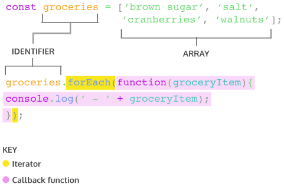

The code above will log a nicely formatted list of the groceries to the console. Let’s explore the syntax of invoking `.forEach()`.

- `groceries.forEach()` calls the `forEach` method on the `groceries` array.
- `.forEach()` takes an argument of callback function. Remember, a callback function is a function passed as an argument into another function.
- `.forEach()` loops through the array and executes the callback function for each element. During each execution, the current element is passed as an argument to the callback function.
- The return value for `.forEach()` will always be `undefined`.

Another way to pass a callback for `.forEach()` is to use arrow function syntax.

```javascript
groceries.forEach(groceryItem => console.log(groceryItem));
```

We can also define a function beforehand to be used as the callback function.

```javascript
function printGrocery(element){
  console.log(element);
}
 
groceries.forEach(printGrocery);
```

The above example uses a function declaration but you can also use a function expression or arrow function as well.

All three code snippets do the same thing. In each array iteration method, we can use any of the three examples to supply a callback function as an argument to the iterator. It’s good to be aware of the different ways to pass in callback functions as arguments in iterators because developers have different stylistic preferences. Nonetheless, due to the strong adoption of ES6, we will be using arrow function syntax in the later exercises.

### The .map() Method

When `.map()` is called on an array, it takes an argument of a callback function and returns a new array! Take a look at an example of calling `.map()`:

```javascript
const numbers = [1, 2, 3, 4, 5]; 
 
const bigNumbers = numbers.map(number => {
  return number * 10;
});
```

`.map()` works in a similar manner to `.forEach()`— the major difference is that `.map()` returns a new array.

In the example above:

- `numbers` is an array of numbers.
- `bigNumbers` will store the return value of calling `.map()` on `numbers`.
- `numbers.map` will iterate through each element in the `numbers` array and pass the element into the callback function.
- `return number * 10` is the code we wish to execute upon each element in the array. This will save each value from the `numbers` array, multiplied by `10`, to a new array.

If we take a look at `numbers` and `bigNumbers`:

```javascript
console.log(numbers); // Output: [1, 2, 3, 4, 5]
console.log(bigNumbers); // Output: [10, 20, 30, 40, 50]
```

Notice that the elements in `numbers` were not altered and `bigNumbers` is a new array.

### The .filter() Method

Another useful iterator method is `.filter()`. Like `.map()`, `.filter()` returns a new array. However, `.filter()` returns an array of elements after filtering out certain elements from the original array. The callback function for the `.filter()` method should return `true` or `false` depending on the element that is passed to it. The elements that cause the callback function to return `true` are added to the new array. Take a look at the following example:

```javascript
const words = ['chair', 'music', 'pillow', 'brick', 'pen', 'door']; 
 
const shortWords = words.filter(word => {
  return word.length < 6;
});
```

- `words` is an array that contains string elements.
- `const shortWords =` declares a new variable that will store the returned array from invoking `.filter()`.
- The callback function is an arrow function has a single parameter, `word`. Each element in the `words` array will be passed to this function as an argument.
- `word.length < 6;` is the condition in the callback function. Any `word` from the `words` array that has fewer than `6` characters will be added to the `shortWords` array.

Let’s also check the values of `words` and `shortWords`:

```javascript
console.log(words); // Output: ['chair', 'music', 'pillow', 'brick', 'pen', 'door']; 
console.log(shortWords); // Output: ['chair', 'music', 'brick', 'pen', 'door']
```

Observe how `words` was not mutated, i.e. changed, and `shortWords` is a new array.

### The .findIndex() Method

We sometimes want to find the location of an element in an array. That’s where the `.findIndex()` method comes in! Calling `.findIndex()` on an array will return the index of the first element that evaluates to `true` in the callback function.

```javascript
const jumbledNums = [123, 25, 78, 5, 9]; 
 
const lessThanTen = jumbledNums.findIndex(num => {
  return num < 10;
});
```


- `jumbledNums` is an array that contains elements that are numbers.
- `const lessThanTen =` declares a new variable that stores the returned index number from invoking `.findIndex()`.
- The callback function is an arrow function that has a single parameter, `num`. Each element in the `jumbledNums` array will be passed to this function as an argument.
- `num < 10;` is the condition that elements are checked against. `.findIndex()` will return the index of the first element which evaluates to `true` for that condition.

Let’s take a look at what `lessThanTen` evaluates to:

```javascript
console.log(lessThanTen); // Output: 3 
```

If we check what element has index of 3:

```javascript
console.log(jumbledNums[3]); // Output: 5
```

Great, the element in index `3` is the number `5`. This makes sense since `5` is the first element that is less than 10.

**If there isn’t a single element in the array that satisfies the condition in the callback, then `.findIndex()` will return `-1`.**

```javascript
const greaterThan1000 = jumbledNums.findIndex(num => {
  return num > 1000;
});
 
console.log(greaterThan1000); // Output: -1
```

### The .reduce() Method

