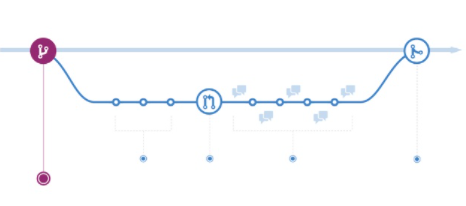
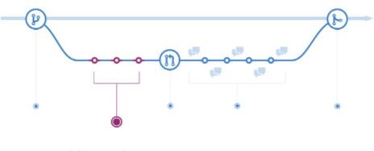
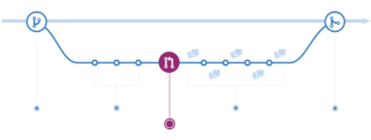
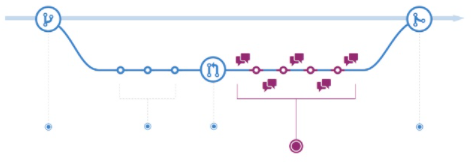
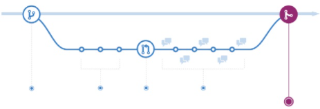
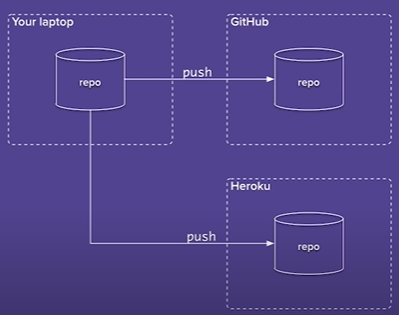
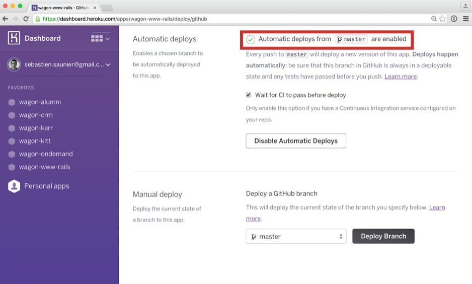
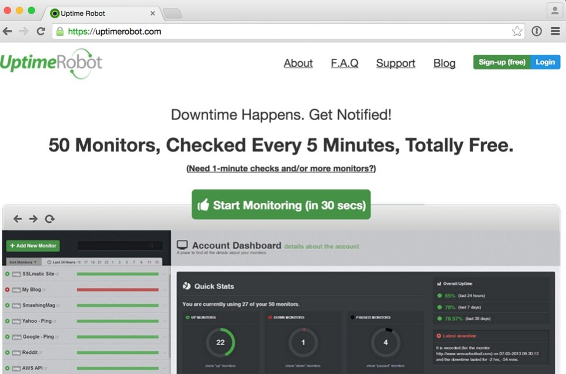
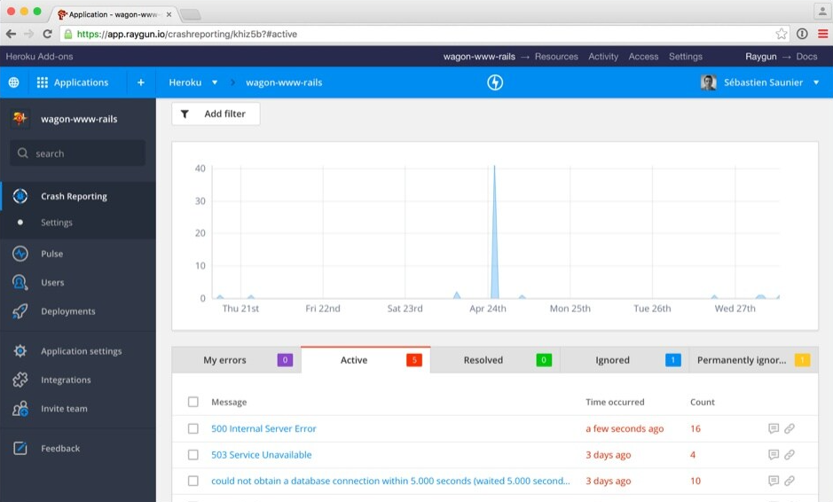

# TECHNICAL WORKFLOW FOR A STARTUP :briefcase:

Workshop video: [Technical Workflow for a Startup](https://www.youtube.com/watch?v=iZkP9rcEJEM&t=12s)

<h2> STARTUP</h2>

A startup is a temporary organization formed to search for a repeatable and scalable business model (STEVE BLANK, 2010). Once you find a business model, you're no longer a startup.

<h2> VERSIONING</h2>

Backup versions of your work and track modifications (here, we add check-points to the code/work). With GitHub we can have a Timeline to track the work. 

### How to Read a Repository

- See the contributors (who is working on the code)
- Take a look at the commits (the check-points of the code)
- See the code

<h2> WORKFLOW</h2>

The workflow that GitHub has defined is based on using Branching and Pull Requests. To add a feature that you want to implement inside the project, we can Branching and Pull Requests. So, how does it work? 

- CREATE A BRANCH: we create it to make the changes that we want. We don't make the changes directly on the master, we work on the **branch** first.

  

- WORK AND COMMIT:

  

- OPEN A PULL REQUEST: submit your work on GitHub through **pull requests**. Write a clear and objective message, if possible, with screenshots of the changes that have been made.

  

- REVIEW: After making all the changes I wanted, I now want someone to take a look at my work, to review the code. Revisions are important because we want the code to look like it was written by a single person.

  

- MERGE: after the revision and all changes have been made, it is possible to merge the work into the master (to the main line).

  

<h2> DEPLOYMENT</h2>

After the changes have been made, and we've made sure they are working on the computer, we can deploy the work. 

At Le Wagon they use [Heroku](https://www.heroku.com/), which hosts the code in the cloud so that the content is visible to customers accessing the site (it's a server). 

In the GitHub workflow, we have a rule, which must be respected: "**ANYTHING IN THE MASTER BRANCH IS DEPLOYABLE**." When we merge the code into the master, we have to make sure the code is running correctly.

### Continuous Deployment

- Deploy your app in production with quick command lines.
- Continuous delivery ensures minimal impact from bugs, and fast feedback from users.

### Automated Deployment

A tool to automatically deploy at every change of the master branch. 

With this kind of process, we can ship really often. But this can cause some problems. For example, if you have 10 deploys per day, some might break, which is not good for startups (we can't break stuff in this case).

And if we break something, we can just **ROLLBACK**, reverting the code to where it was before it broke.

<h2> TESTING</h2>

How can we prevent breaking things? We can prevent TESTING!

When we have a site with many features, we can write a code to automate the test and check when a change is made (a new feature is added), if this change hasn't affected any of the other features. **The best practice is to write a test code to every feature**.

- Never push your code without testing! ⚠️
- Implement Test-Driven Development to avoid huge future technical debt.
- Implement bug tracking and reporting.

### Travis CI

Travis CI automatically test every commit pushed on every branch. We get a feedback inside the pull request if we broke something (visual feedback: green and red button).

<h2> CONTINUOUS DEPLOYMENT</h2>

- Deploy your app in production with quick command lines.
- Continuous delivery ensures minimal impact from bugs, and fast feedback from users.

"The key test is that a business sponsor could request that the current development version of the software can be deployed into production at a moment's notice - and nobody would bat an eyelid, let alone panic."

### Advantages

- Reduced deployment risk - because you don't deploy a lot of stuff at once.
- Real sense of progress (done - the code is in the hand of the end user, the customer)
- User feedback

<h2> BACKUPS</h2>

When we make a change to the code and break something, for example, we can rollback and go back to the code that was working. However, when we have a database and, for example, we delete a column, when we rollback that column does not come back, so it is necessary to have a **backup for the database**. That way we can restore the data.

Prevent the loss of data with automatic backups of your database.

<h2> MONITORING</h2>

It consists of checking if the website is working correctly, and if it is always working.

This software updates your page every 5 seconds and if the site is down it sends you an email. But sometimes more information is needed, so there are software that detect errors, such as raygun.

<h2> ISSUE TRACKER</h2>

Every time you see a bug you need a place to tell someone there is a bug. 

Embrace simplicity!

<h2> ADVICES FROM A DEVELOPER</h2>

- Resist meta-work (when we stop to talk about work and how we're going to do the work)
- Avoid meetings
- Write everything (like in slack)
- Embrace asynchronicity
- Don't pull me from the zone