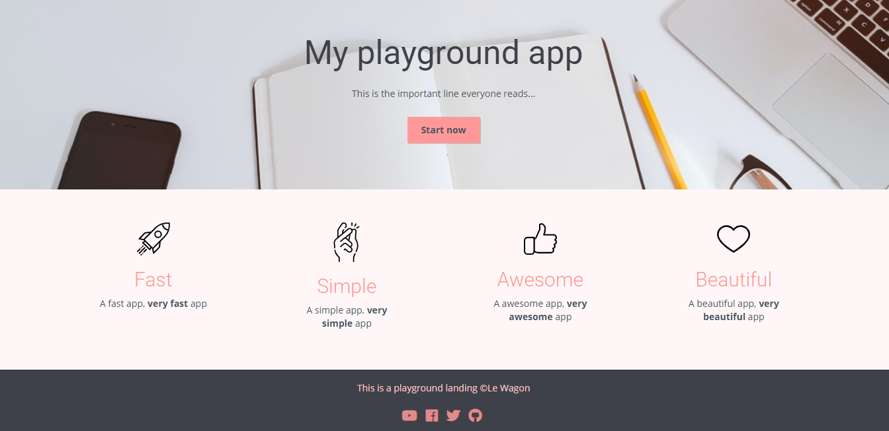

# THE 2-HOUR LANDING PAGE 

In this course, I created a website using HTML and CSS:

## Resources

- Icons: [Icon store](http://iconstore.co/), [The Noun Project](https://thenounproject.com/), [NucleoApp](https://nucleoapp.com/premium-icons/)
- Fonts: [Google Fonts](https://fonts.google.com/)
- Colors: [Colorzilla](http://www.colorzilla.com/chrome/), [Coolors](https://coolors.co/), [Color Hunt](http://colorhunt.co/)
- Background images: [Pexels](https://www.pexels.com/)
- CSS libraries: [Bootstrap](http://getbootstrap.com/), [Material Design](https://material.google.com/)
- Workshop video: [Build your website with HTML & CSS](https://www.youtube.com/watch?v=-9ZheXYOMeM&t=12s)